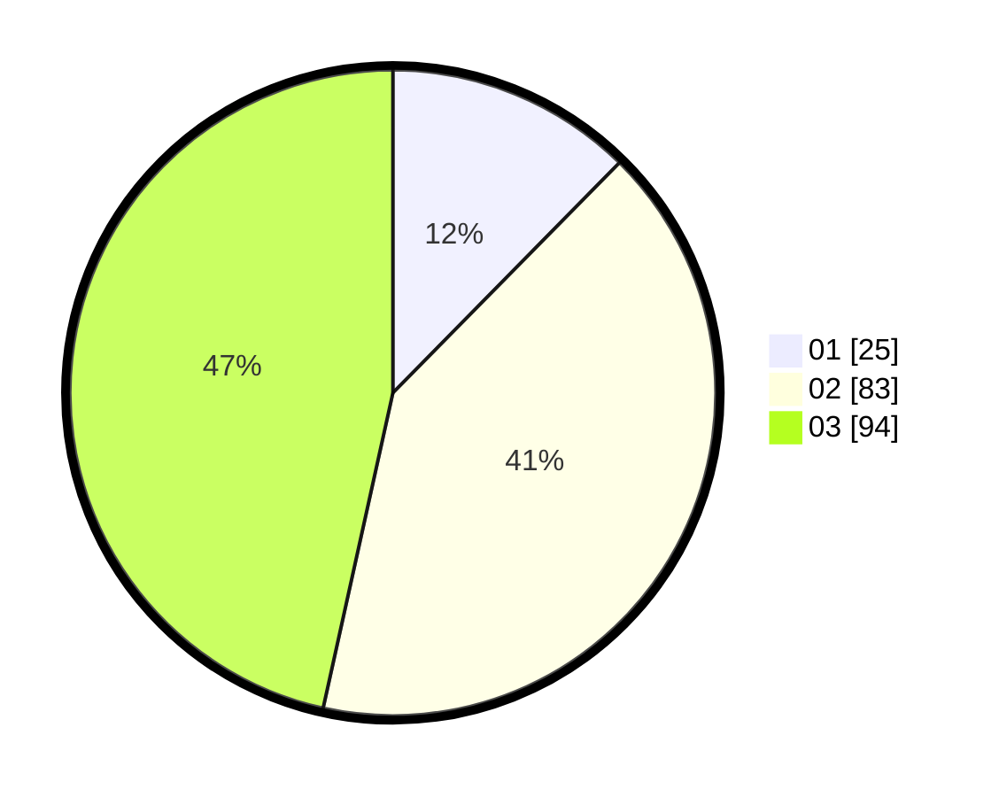

# Hasil

Hasil perolehan suara paslon dapat dilihat pada file paslon-01.txt, paslon-02.txt, dan paslon-03.txt.

Jika tidak ada, artinya data tersebut belum ada pada SIREKAP.

## Perolehan Suara

 * Paslon 01: **25**.
 * Paslon 02: **83**.
 * Paslon 03: **94**.

## Foto C Plano

https://sirekap-obj-formc.kpu.go.id/8057/pemilu/ppwp/31/73/01/10/06/3173011006011-20240216-092849--d2c40bf5-1843-4624-b550-7e078942cbb0.jpg

https://sirekap-obj-formc.kpu.go.id/8057/pemilu/ppwp/31/73/01/10/06/3173011006011-20240216-092850--906a4570-1863-44ac-867c-dc58a844e7c7.jpg

https://sirekap-obj-formc.kpu.go.id/8057/pemilu/ppwp/31/73/01/10/06/3173011006011-20240216-092850--b3f96bd7-7fe7-4451-94d0-e13bdc373ba6.jpg

## DATA PEMILIH TETAP

Jumlah pemilih dalam DPT: **0**.
 * L: **0**.
 * P: **0**.

## DATA PENGGUNA HAK PILIH

Jumlah pengguna hak pilih dalam DPT: **0**.
 * L: **0**.
 * P: **0**.

Jumlah pengguna hak pilih dalam DPTb: **0**.
 * L: **0**.
 * P: **0**.

Jumlah pengguna hak pilih dalam DPK: **0**.
 * L: **0**.
 * P: **0**.

Jumlah pengguna hak pilih: **0**.
 * L: **0**.
 * P: **0**.

## JUMLAH SUARA SAH DAN TIDAK SAH

JUMLAH SELURUH SUARA SAH: **202**.

JUMLAH SUARA TIDAK SAH: **2**.

JUMLAH SELURUH SUARA SAH DAN SUARA TIDAK SAH: **204**.
