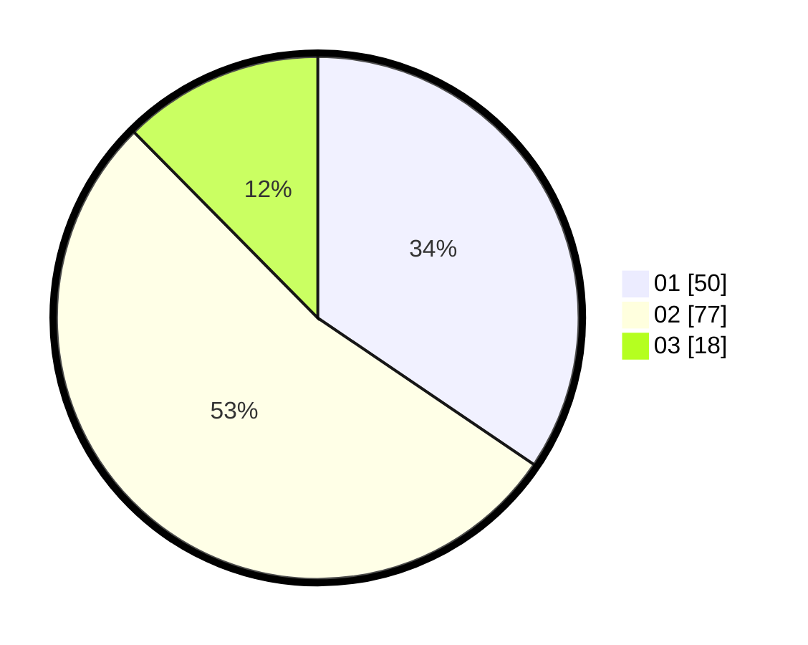

# Hasil

Hasil perolehan suara paslon dapat dilihat pada file paslon-01.txt, paslon-02.txt, dan paslon-03.txt.

Jika tidak ada, artinya data tersebut belum ada pada SIREKAP.

## Perolehan Suara

 * Paslon 01: **50**.
 * Paslon 02: **77**.
 * Paslon 03: **18**.

## Foto C Plano

https://sirekap-obj-formc.kpu.go.id/8374/pemilu/ppwp/31/73/01/10/06/3173011006019-20240215-215338--7d54521c-fd0c-4fe0-9fa3-41658d418dc4.jpg

https://sirekap-obj-formc.kpu.go.id/8374/pemilu/ppwp/31/73/01/10/06/3173011006019-20240215-215341--439bdce3-0580-4543-b4c3-85209527cc0f.jpg

https://sirekap-obj-formc.kpu.go.id/8374/pemilu/ppwp/31/73/01/10/06/3173011006019-20240215-215340--6af1d7a3-907c-4042-9516-0105eade567e.jpg

## DATA PEMILIH TETAP

Jumlah pemilih dalam DPT: **205**.
 * L: **108**.
 * P: **97**.

## DATA PENGGUNA HAK PILIH

Jumlah pengguna hak pilih dalam DPT: **147**.
 * L: **73**.
 * P: **74**.

Jumlah pengguna hak pilih dalam DPTb: **0**.
 * L: **0**.
 * P: **0**.

Jumlah pengguna hak pilih dalam DPK: **3**.
 * L: **2**.
 * P: **1**.

Jumlah pengguna hak pilih: **150**.
 * L: **75**.
 * P: **75**.

## JUMLAH SUARA SAH DAN TIDAK SAH

JUMLAH SELURUH SUARA SAH: **145**.

JUMLAH SUARA TIDAK SAH: **5**.

JUMLAH SELURUH SUARA SAH DAN SUARA TIDAK SAH: **150**.
