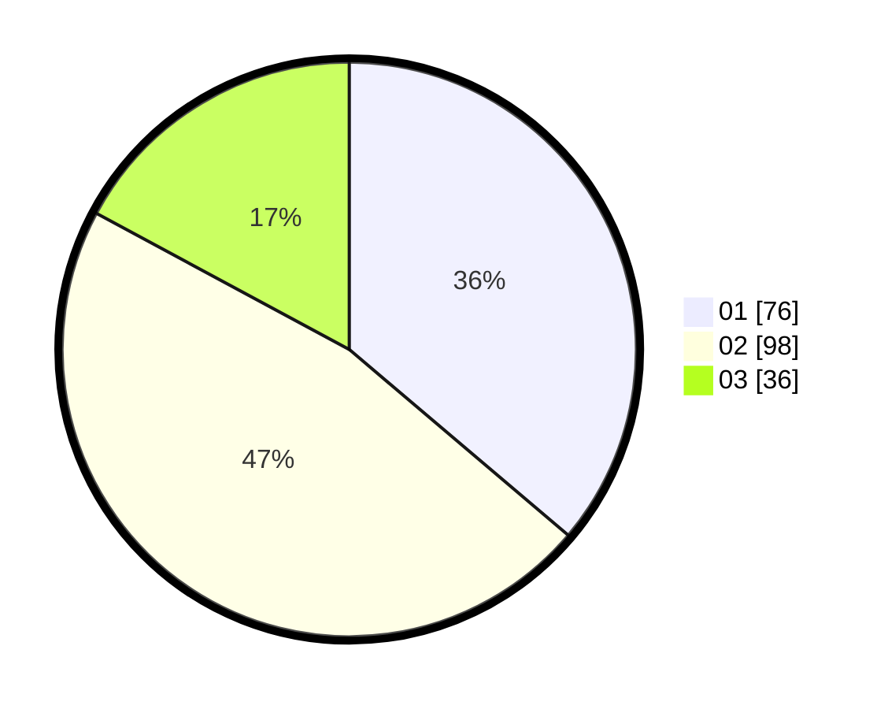

# Hasil

Hasil perolehan suara paslon dapat dilihat pada file paslon-01.txt, paslon-02.txt, dan paslon-03.txt.

Jika tidak ada, artinya data tersebut belum ada pada SIREKAP.

## Perolehan Suara

 * Paslon 01: **76**.
 * Paslon 02: **98**.
 * Paslon 03: **36**.

## Foto C Plano

https://sirekap-obj-formc.kpu.go.id/b1ce/pemilu/ppwp/31/73/01/10/06/3173011006023-20240215-013803--2476cff8-2ce4-4373-bf92-9ea729af263f.jpg

https://sirekap-obj-formc.kpu.go.id/b1ce/pemilu/ppwp/31/73/01/10/06/3173011006023-20240215-014329--5adf3d15-8ca6-4677-adc7-ded313ff222a.jpg

https://sirekap-obj-formc.kpu.go.id/b1ce/pemilu/ppwp/31/73/01/10/06/3173011006023-20240215-014429--2db01bc8-7dc0-462c-a7ce-be18ca8754be.jpg
