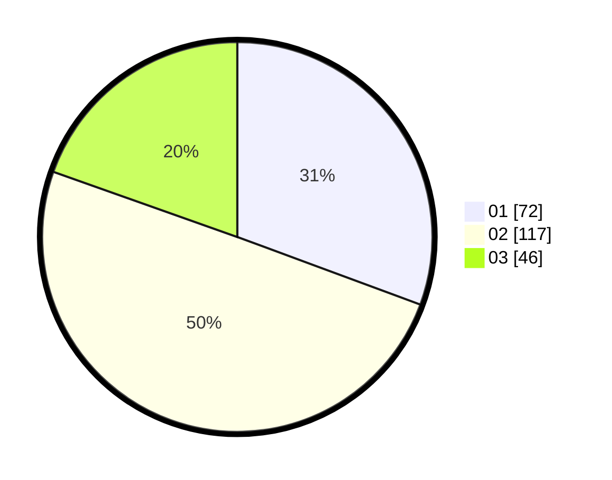

# Hasil

Hasil perolehan suara paslon dapat dilihat pada file paslon-01.txt, paslon-02.txt, dan paslon-03.txt.

Jika tidak ada, artinya data tersebut belum ada pada SIREKAP.

## Perolehan Suara

 * Paslon 01: **72**.
 * Paslon 02: **117**.
 * Paslon 03: **46**.

## Foto C Plano

https://sirekap-obj-formc.kpu.go.id/b988/pemilu/ppwp/31/73/01/10/06/3173011006030-20240214-214859--4333accd-fe75-4a67-9d5d-4ec8b71f85ab.jpg

https://sirekap-obj-formc.kpu.go.id/b988/pemilu/ppwp/31/73/01/10/06/3173011006030-20240214-212638--8d5fdd87-4b69-4ee4-9085-3e5e403db2c2.jpg

https://sirekap-obj-formc.kpu.go.id/b988/pemilu/ppwp/31/73/01/10/06/3173011006030-20240214-212728--495cb033-900e-4c2d-96e0-6b9cc0050358.jpg
