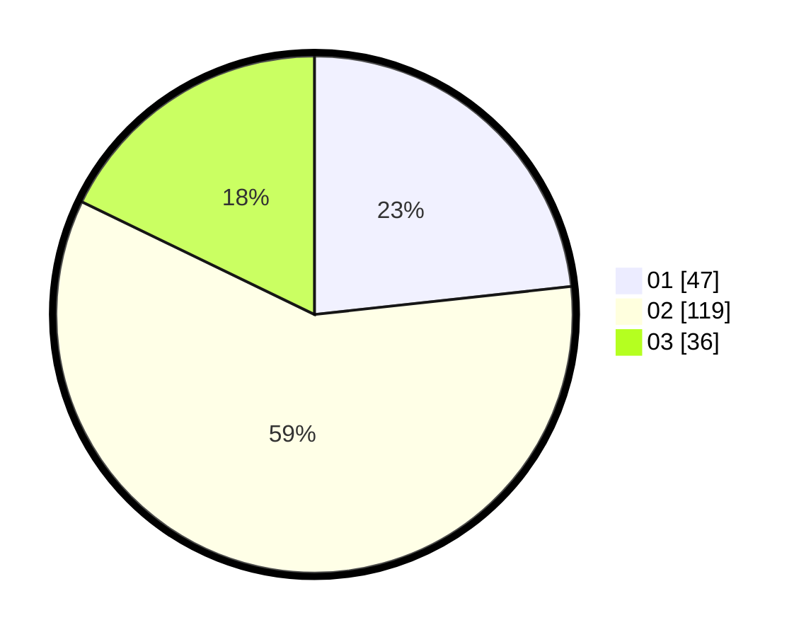

# Hasil

Hasil perolehan suara paslon dapat dilihat pada file paslon-01.txt, paslon-02.txt, dan paslon-03.txt.

Jika tidak ada, artinya data tersebut belum ada pada SIREKAP.

## Perolehan Suara

 * Paslon 01: **47**.
 * Paslon 02: **119**.
 * Paslon 03: **36**.

## Foto C Plano

https://sirekap-obj-formc.kpu.go.id/8bff/pemilu/ppwp/31/73/01/10/06/3173011006031-20240214-210040--7dc70c9f-6b55-420b-b9ae-d1e726427aca.jpg

https://sirekap-obj-formc.kpu.go.id/8bff/pemilu/ppwp/31/73/01/10/06/3173011006031-20240214-210137--00b5ad5d-35c8-470a-9186-75038e3a1086.jpg

https://sirekap-obj-formc.kpu.go.id/8bff/pemilu/ppwp/31/73/01/10/06/3173011006031-20240214-210222--e441339c-acc1-42bf-8077-48d821f8a4ab.jpg

## DATA PEMILIH TETAP

Jumlah pemilih dalam DPT: **295**.
 * L: **149**.
 * P: **146**.

## DATA PENGGUNA HAK PILIH

Jumlah pengguna hak pilih dalam DPT: **205**.
 * L: **106**.
 * P: **99**.

Jumlah pengguna hak pilih dalam DPTb: **0**.
 * L: **0**.
 * P: **0**.

Jumlah pengguna hak pilih dalam DPK: **0**.
 * L: **0**.
 * P: **0**.

Jumlah pengguna hak pilih: **205**.
 * L: **106**.
 * P: **99**.

## JUMLAH SUARA SAH DAN TIDAK SAH

JUMLAH SELURUH SUARA SAH: **202**.

JUMLAH SUARA TIDAK SAH: **3**.

JUMLAH SELURUH SUARA SAH DAN SUARA TIDAK SAH: **205**.
