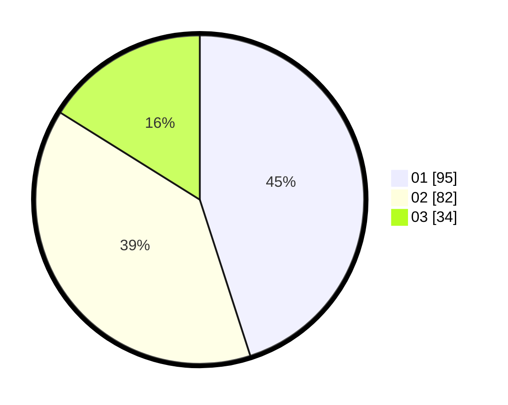

# Hasil

Hasil perolehan suara paslon dapat dilihat pada file paslon-01.txt, paslon-02.txt, dan paslon-03.txt.

Jika tidak ada, artinya data tersebut belum ada pada SIREKAP.

## Perolehan Suara

 * Paslon 01: **95**.
 * Paslon 02: **82**.
 * Paslon 03: **34**.

## Foto C Plano

https://sirekap-obj-formc.kpu.go.id/b5bf/pemilu/ppwp/31/73/01/10/06/3173011006032-20240216-030425--1e7711f0-927e-4c35-897c-0f479c00b88f.jpg

https://sirekap-obj-formc.kpu.go.id/b5bf/pemilu/ppwp/31/73/01/10/06/3173011006032-20240216-030427--6ee3ee90-2f2b-481c-94ad-1cea083d17f3.jpg

https://sirekap-obj-formc.kpu.go.id/b5bf/pemilu/ppwp/31/73/01/10/06/3173011006032-20240216-030427--2db5d6d7-bc86-4056-99ed-181adf8e9b95.jpg

## DATA PEMILIH TETAP

Jumlah pemilih dalam DPT: **286**.
 * L: **150**.
 * P: **136**.

## DATA PENGGUNA HAK PILIH

Jumlah pengguna hak pilih dalam DPT: **215**.
 * L: **108**.
 * P: **107**.

Jumlah pengguna hak pilih dalam DPTb: **0**.
 * L: **0**.
 * P: **0**.

Jumlah pengguna hak pilih dalam DPK: **1**.
 * L: **0**.
 * P: **1**.

Jumlah pengguna hak pilih: **216**.
 * L: **108**.
 * P: **108**.

## JUMLAH SUARA SAH DAN TIDAK SAH

JUMLAH SELURUH SUARA SAH: **211**.

JUMLAH SUARA TIDAK SAH: **5**.

JUMLAH SELURUH SUARA SAH DAN SUARA TIDAK SAH: **216**.
