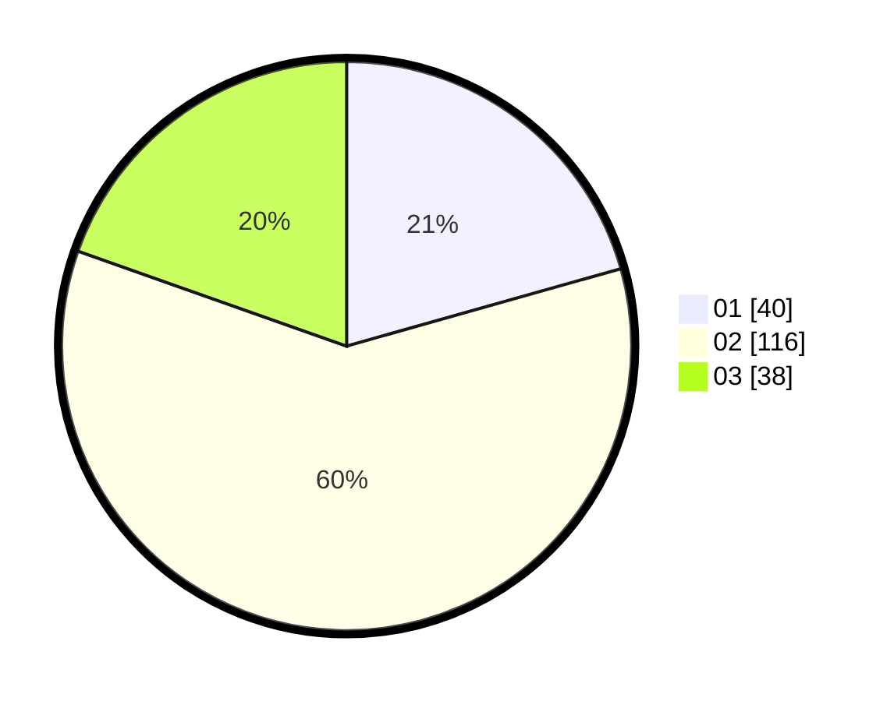

# Hasil

Hasil perolehan suara paslon dapat dilihat pada file paslon-01.txt, paslon-02.txt, dan paslon-03.txt.

Jika tidak ada, artinya data tersebut belum ada pada SIREKAP.

## Perolehan Suara

 * Paslon 01: **40**.
 * Paslon 02: **116**.
 * Paslon 03: **38**.

## Foto C Plano

https://sirekap-obj-formc.kpu.go.id/690e/pemilu/ppwp/31/73/01/10/06/3173011006035-20240214-231605--d52fca02-dc54-411b-b729-593a74a28320.jpg

https://sirekap-obj-formc.kpu.go.id/690e/pemilu/ppwp/31/73/01/10/06/3173011006035-20240214-231803--0fd4e741-daeb-4105-8b49-e027e190ba32.jpg

https://sirekap-obj-formc.kpu.go.id/690e/pemilu/ppwp/31/73/01/10/06/3173011006035-20240214-232128--b1064723-3e2c-488c-8c01-a483475bbb11.jpg
