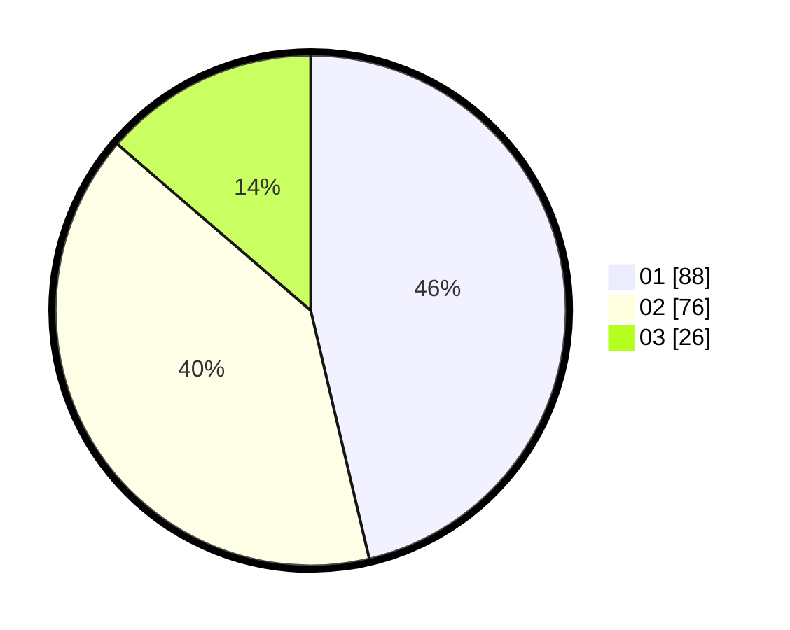

# Hasil

Hasil perolehan suara paslon dapat dilihat pada file paslon-01.txt, paslon-02.txt, dan paslon-03.txt.

Jika tidak ada, artinya data tersebut belum ada pada SIREKAP.

## Perolehan Suara

 * Paslon 01: **88**.
 * Paslon 02: **76**.
 * Paslon 03: **26**.

## Foto C Plano

https://sirekap-obj-formc.kpu.go.id/055f/pemilu/ppwp/31/73/01/10/06/3173011006038-20240216-010757--7620e7e9-ca1e-4a0f-8370-1da606a01710.jpg

https://sirekap-obj-formc.kpu.go.id/055f/pemilu/ppwp/31/73/01/10/06/3173011006038-20240216-010800--bce8a244-2aed-455d-bf24-510827d1d228.jpg

https://sirekap-obj-formc.kpu.go.id/055f/pemilu/ppwp/31/73/01/10/06/3173011006038-20240216-010757--74f213ee-c1f5-4ec5-85a9-edabcc906e1b.jpg

## DATA PEMILIH TETAP

Jumlah pemilih dalam DPT: **265**.
 * L: **128**.
 * P: **137**.

## DATA PENGGUNA HAK PILIH

Jumlah pengguna hak pilih dalam DPT: **193**.
 * L: **92**.
 * P: **101**.

Jumlah pengguna hak pilih dalam DPTb: **0**.
 * L: **0**.
 * P: **0**.

Jumlah pengguna hak pilih dalam DPK: **0**.
 * L: **0**.
 * P: **0**.

Jumlah pengguna hak pilih: **193**.
 * L: **92**.
 * P: **101**.

## JUMLAH SUARA SAH DAN TIDAK SAH

JUMLAH SELURUH SUARA SAH: **190**.

JUMLAH SUARA TIDAK SAH: **3**.

JUMLAH SELURUH SUARA SAH DAN SUARA TIDAK SAH: **193**.
