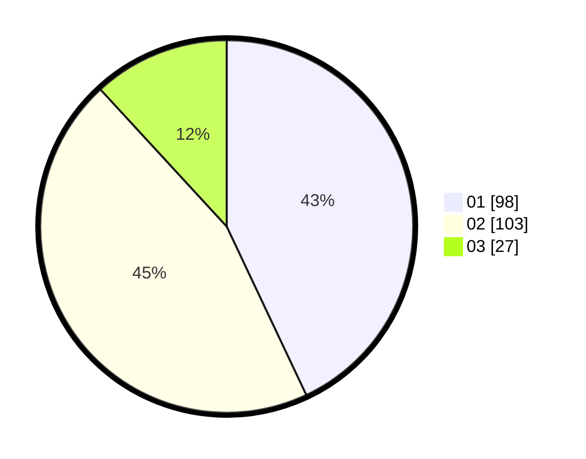

# Hasil

Hasil perolehan suara paslon dapat dilihat pada file paslon-01.txt, paslon-02.txt, dan paslon-03.txt.

Jika tidak ada, artinya data tersebut belum ada pada SIREKAP.

## Perolehan Suara

 * Paslon 01: **98**.
 * Paslon 02: **103**.
 * Paslon 03: **27**.

## Foto C Plano

https://sirekap-obj-formc.kpu.go.id/6444/pemilu/ppwp/31/73/01/10/06/3173011006040-20240216-073300--46dc65c7-f13d-403e-add2-41b332a6225c.jpg

https://sirekap-obj-formc.kpu.go.id/6444/pemilu/ppwp/31/73/01/10/06/3173011006040-20240214-200418--28de1325-794c-4061-a785-5b90747df471.jpg

https://sirekap-obj-formc.kpu.go.id/6444/pemilu/ppwp/31/73/01/10/06/3173011006040-20240214-195253--0293f45e-7bb3-44f2-92ac-ea4baf5b6c95.jpg

## DATA PEMILIH TETAP

Jumlah pemilih dalam DPT: **296**.
 * L: **143**.
 * P: **153**.

## DATA PENGGUNA HAK PILIH

Jumlah pengguna hak pilih dalam DPT: **231**.
 * L: **113**.
 * P: **118**.

Jumlah pengguna hak pilih dalam DPTb: **0**.
 * L: **0**.
 * P: **0**.

Jumlah pengguna hak pilih dalam DPK: **3**.
 * L: **2**.
 * P: **1**.

Jumlah pengguna hak pilih: **234**.
 * L: **115**.
 * P: **119**.

## JUMLAH SUARA SAH DAN TIDAK SAH

JUMLAH SELURUH SUARA SAH: **228**.

JUMLAH SUARA TIDAK SAH: **6**.

JUMLAH SELURUH SUARA SAH DAN SUARA TIDAK SAH: **234**.
