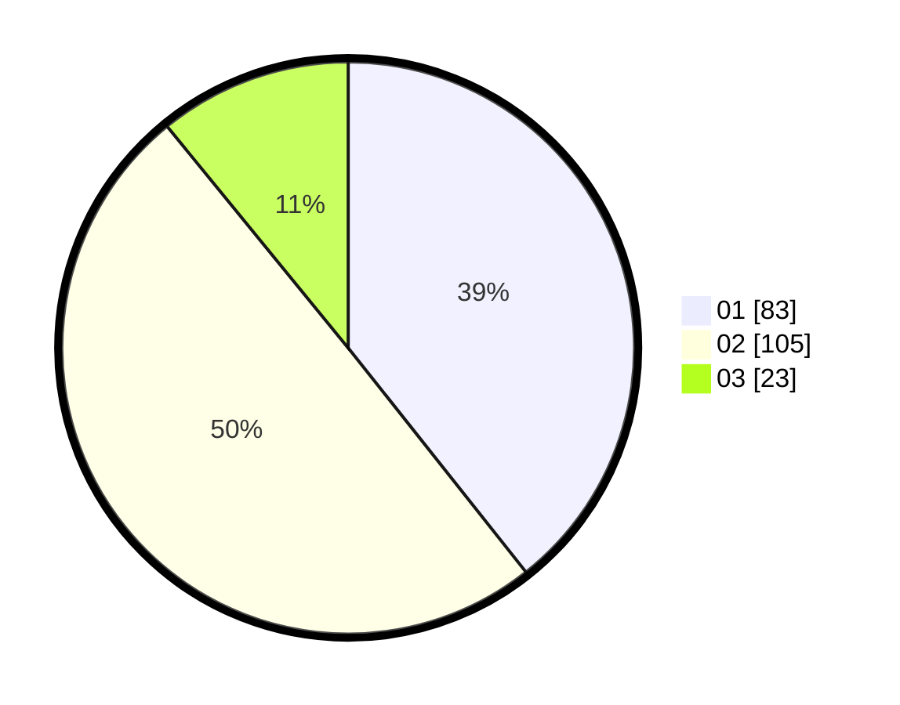

# Hasil

Hasil perolehan suara paslon dapat dilihat pada file paslon-01.txt, paslon-02.txt, dan paslon-03.txt.

Jika tidak ada, artinya data tersebut belum ada pada SIREKAP.

## Perolehan Suara

 * Paslon 01: **83**.
 * Paslon 02: **105**.
 * Paslon 03: **23**.

## Foto C Plano

https://sirekap-obj-formc.kpu.go.id/494b/pemilu/ppwp/31/73/01/10/06/3173011006041-20240215-141217--03a6dbb0-4f63-4ec0-8a00-12b719b0cf71.jpg

https://sirekap-obj-formc.kpu.go.id/494b/pemilu/ppwp/31/73/01/10/06/3173011006041-20240215-141246--86c8c41f-a982-434e-9960-553e594ff159.jpg

https://sirekap-obj-formc.kpu.go.id/494b/pemilu/ppwp/31/73/01/10/06/3173011006041-20240215-141228--7f1995d6-5467-478d-bf4a-108189f4ea44.jpg

## DATA PEMILIH TETAP

Jumlah pemilih dalam DPT: **291**.
 * L: **148**.
 * P: **143**.

## DATA PENGGUNA HAK PILIH

Jumlah pengguna hak pilih dalam DPT: **217**.
 * L: **106**.
 * P: **111**.

Jumlah pengguna hak pilih dalam DPTb: **2**.
 * L: **1**.
 * P: **1**.

Jumlah pengguna hak pilih dalam DPK: **0**.
 * L: **0**.
 * P: **0**.

Jumlah pengguna hak pilih: **219**.
 * L: **107**.
 * P: **112**.

## JUMLAH SUARA SAH DAN TIDAK SAH

JUMLAH SELURUH SUARA SAH: **215**.

JUMLAH SUARA TIDAK SAH: **4**.

JUMLAH SELURUH SUARA SAH DAN SUARA TIDAK SAH: **219**.
