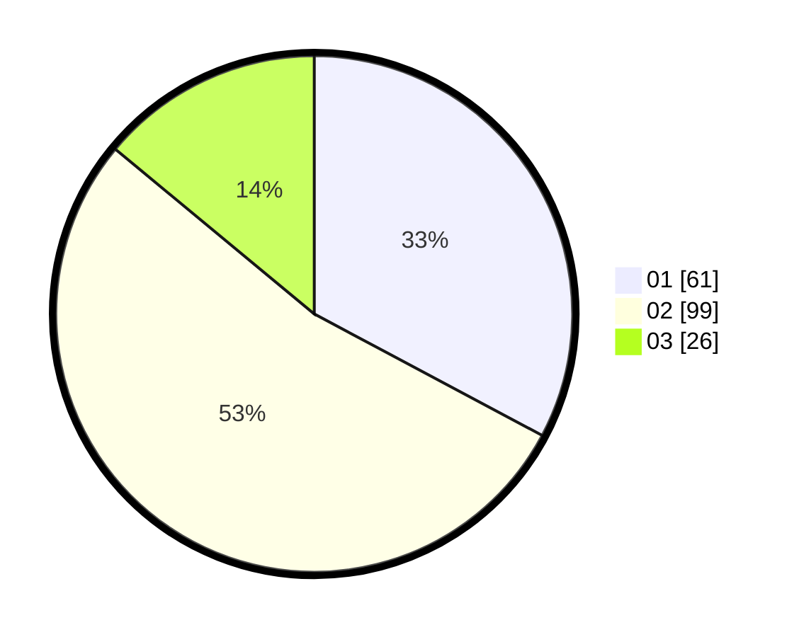

# Hasil

Hasil perolehan suara paslon dapat dilihat pada file paslon-01.txt, paslon-02.txt, dan paslon-03.txt.

Jika tidak ada, artinya data tersebut belum ada pada SIREKAP.

## Perolehan Suara

 * Paslon 01: **61**.
 * Paslon 02: **99**.
 * Paslon 03: **26**.

## Foto C Plano

https://sirekap-obj-formc.kpu.go.id/3461/pemilu/ppwp/31/73/01/10/06/3173011006042-20240215-215421--ad79a329-b2db-4f2d-b2d1-9112917abb2f.jpg

https://sirekap-obj-formc.kpu.go.id/3461/pemilu/ppwp/31/73/01/10/06/3173011006042-20240215-215423--b4482f40-8c46-4119-bbd1-b313c49aa458.jpg

https://sirekap-obj-formc.kpu.go.id/3461/pemilu/ppwp/31/73/01/10/06/3173011006042-20240215-215422--d32d0eeb-5c29-4430-b3a5-7c954827c131.jpg

## DATA PEMILIH TETAP

Jumlah pemilih dalam DPT: **247**.
 * L: **117**.
 * P: **130**.

## DATA PENGGUNA HAK PILIH

Jumlah pengguna hak pilih dalam DPT: **183**.
 * L: **87**.
 * P: **96**.

Jumlah pengguna hak pilih dalam DPTb: **5**.
 * L: **0**.
 * P: **5**.

Jumlah pengguna hak pilih dalam DPK: **0**.
 * L: **0**.
 * P: **0**.

Jumlah pengguna hak pilih: **188**.
 * L: **87**.
 * P: **101**.

## JUMLAH SUARA SAH DAN TIDAK SAH

JUMLAH SELURUH SUARA SAH: **186**.

JUMLAH SUARA TIDAK SAH: **2**.

JUMLAH SELURUH SUARA SAH DAN SUARA TIDAK SAH: **188**.
