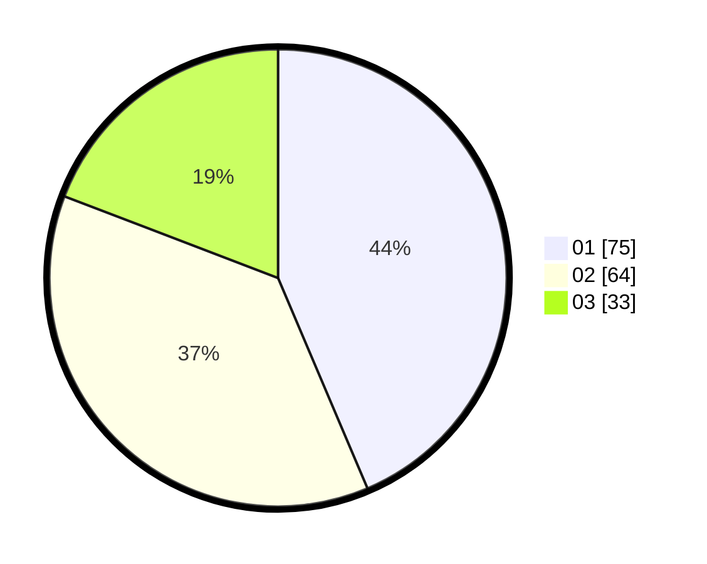

# Hasil

Hasil perolehan suara paslon dapat dilihat pada file paslon-01.txt, paslon-02.txt, dan paslon-03.txt.

Jika tidak ada, artinya data tersebut belum ada pada SIREKAP.

## Perolehan Suara

 * Paslon 01: **75**.
 * Paslon 02: **64**.
 * Paslon 03: **33**.

## Foto C Plano

https://sirekap-obj-formc.kpu.go.id/50f6/pemilu/ppwp/31/73/01/10/06/3173011006043-20240216-015933--77fecc3d-1575-4afb-b9d4-070559ab9bc9.jpg

https://sirekap-obj-formc.kpu.go.id/50f6/pemilu/ppwp/31/73/01/10/06/3173011006043-20240216-015935--1c77ec20-3658-426e-9aff-faf5e6ccec81.jpg

https://sirekap-obj-formc.kpu.go.id/50f6/pemilu/ppwp/31/73/01/10/06/3173011006043-20240216-015934--ea577437-814e-46c4-a436-6526b8a470ce.jpg

## DATA PEMILIH TETAP

Jumlah pemilih dalam DPT: **213**.
 * L: **115**.
 * P: **98**.

## DATA PENGGUNA HAK PILIH

Jumlah pengguna hak pilih dalam DPT: **175**.
 * L: **88**.
 * P: **87**.

Jumlah pengguna hak pilih dalam DPTb: **0**.
 * L: **0**.
 * P: **0**.

Jumlah pengguna hak pilih dalam DPK: **0**.
 * L: **0**.
 * P: **0**.

Jumlah pengguna hak pilih: **175**.
 * L: **88**.
 * P: **87**.

## JUMLAH SUARA SAH DAN TIDAK SAH

JUMLAH SELURUH SUARA SAH: **172**.

JUMLAH SUARA TIDAK SAH: **3**.

JUMLAH SELURUH SUARA SAH DAN SUARA TIDAK SAH: **175**.
