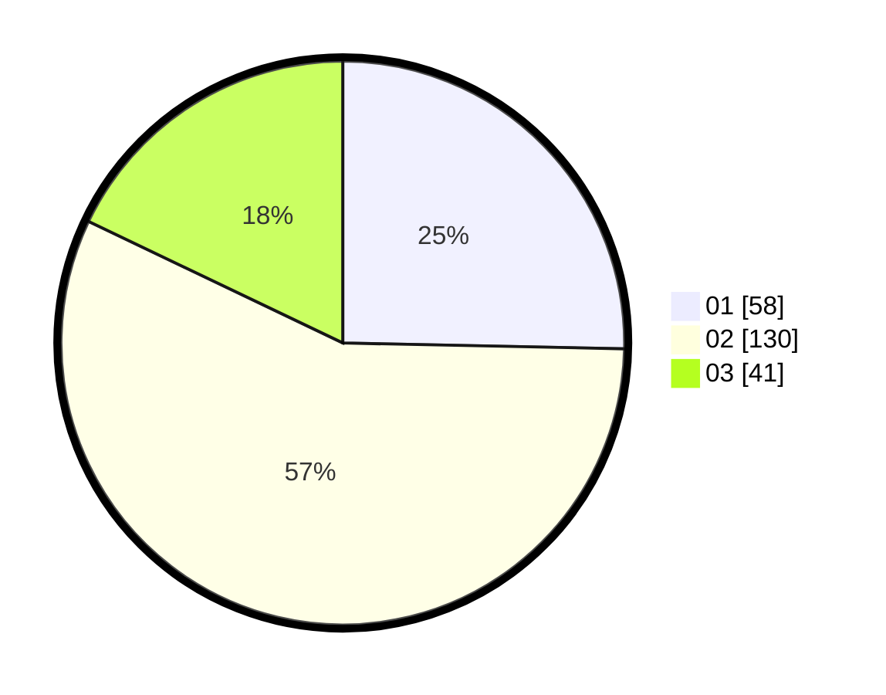

# Hasil

Hasil perolehan suara paslon dapat dilihat pada file paslon-01.txt, paslon-02.txt, dan paslon-03.txt.

Jika tidak ada, artinya data tersebut belum ada pada SIREKAP.

## Perolehan Suara

 * Paslon 01: **58**.
 * Paslon 02: **130**.
 * Paslon 03: **41**.

## Foto C Plano

https://sirekap-obj-formc.kpu.go.id/926d/pemilu/ppwp/31/73/01/10/06/3173011006046-20240215-101022--1a198833-ed8d-421f-b308-dd8c29fd79d3.jpg

https://sirekap-obj-formc.kpu.go.id/926d/pemilu/ppwp/31/73/01/10/06/3173011006046-20240215-101044--ebbebd62-af33-4b11-8879-d45c7c5de69a.jpg

https://sirekap-obj-formc.kpu.go.id/926d/pemilu/ppwp/31/73/01/10/06/3173011006046-20240215-101033--52e1f875-2dce-45a9-834e-7fb967303c01.jpg

## DATA PEMILIH TETAP

Jumlah pemilih dalam DPT: **283**.
 * L: **157**.
 * P: **126**.

## DATA PENGGUNA HAK PILIH

Jumlah pengguna hak pilih dalam DPT: **225**.
 * L: **119**.
 * P: **106**.

Jumlah pengguna hak pilih dalam DPTb: **5**.
 * L: **5**.
 * P: **0**.

Jumlah pengguna hak pilih dalam DPK: **1**.
 * L: **0**.
 * P: **1**.

Jumlah pengguna hak pilih: **231**.
 * L: **124**.
 * P: **107**.

## JUMLAH SUARA SAH DAN TIDAK SAH

JUMLAH SELURUH SUARA SAH: **229**.

JUMLAH SUARA TIDAK SAH: **2**.

JUMLAH SELURUH SUARA SAH DAN SUARA TIDAK SAH: **231**.
