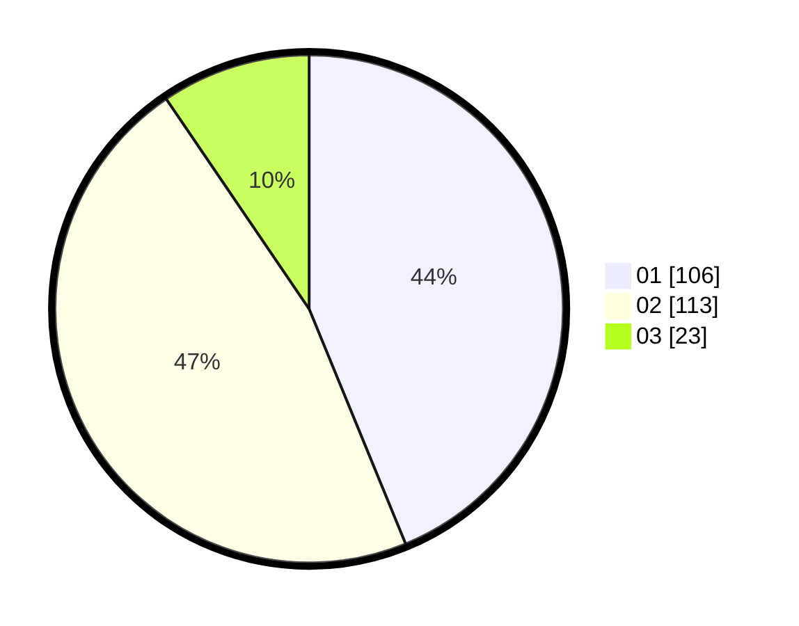

# Hasil

Hasil perolehan suara paslon dapat dilihat pada file paslon-01.txt, paslon-02.txt, dan paslon-03.txt.

Jika tidak ada, artinya data tersebut belum ada pada SIREKAP.

## Perolehan Suara

 * Paslon 01: **106**.
 * Paslon 02: **113**.
 * Paslon 03: **23**.

## Foto C Plano

https://sirekap-obj-formc.kpu.go.id/40b1/pemilu/ppwp/31/73/01/10/06/3173011006048-20240214-203426--e84dcf6f-65b8-463a-88c4-7cb435500aa5.jpg

https://sirekap-obj-formc.kpu.go.id/40b1/pemilu/ppwp/31/73/01/10/06/3173011006048-20240214-212101--f0c3f176-7d43-438c-847e-f15370d70d13.jpg

https://sirekap-obj-formc.kpu.go.id/40b1/pemilu/ppwp/31/73/01/10/06/3173011006048-20240214-212211--8129bd4e-2282-45ce-a37d-706a26c57fde.jpg
