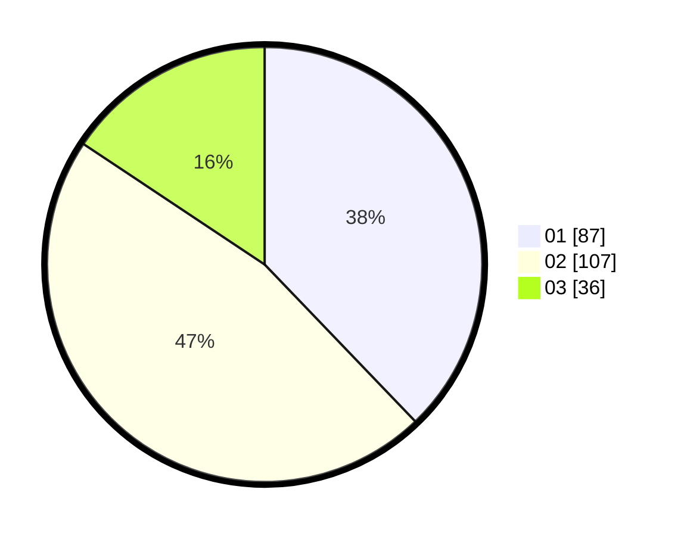

# Hasil

Hasil perolehan suara paslon dapat dilihat pada file paslon-01.txt, paslon-02.txt, dan paslon-03.txt.

Jika tidak ada, artinya data tersebut belum ada pada SIREKAP.

## Perolehan Suara

 * Paslon 01: **87**.
 * Paslon 02: **107**.
 * Paslon 03: **36**.

## Foto C Plano

https://sirekap-obj-formc.kpu.go.id/310d/pemilu/ppwp/31/73/01/10/06/3173011006050-20240216-034157--49c878fa-e575-40d6-8c88-de253f076a1c.jpg

https://sirekap-obj-formc.kpu.go.id/310d/pemilu/ppwp/31/73/01/10/06/3173011006050-20240216-033619--e1f7d734-cb96-4cf7-8bcb-8fe1dd2657ba.jpg

https://sirekap-obj-formc.kpu.go.id/310d/pemilu/ppwp/31/73/01/10/06/3173011006050-20240216-033617--6798a913-8884-4d4f-a85b-1d320e2d2c85.jpg

## DATA PEMILIH TETAP

Jumlah pemilih dalam DPT: **269**.
 * L: **131**.
 * P: **138**.

## DATA PENGGUNA HAK PILIH

Jumlah pengguna hak pilih dalam DPT: **232**.
 * L: **107**.
 * P: **125**.

Jumlah pengguna hak pilih dalam DPTb: **0**.
 * L: **0**.
 * P: **0**.

Jumlah pengguna hak pilih dalam DPK: **0**.
 * L: **0**.
 * P: **0**.

Jumlah pengguna hak pilih: **232**.
 * L: **107**.
 * P: **125**.

## JUMLAH SUARA SAH DAN TIDAK SAH

JUMLAH SELURUH SUARA SAH: **230**.

JUMLAH SUARA TIDAK SAH: **2**.

JUMLAH SELURUH SUARA SAH DAN SUARA TIDAK SAH: **232**.
