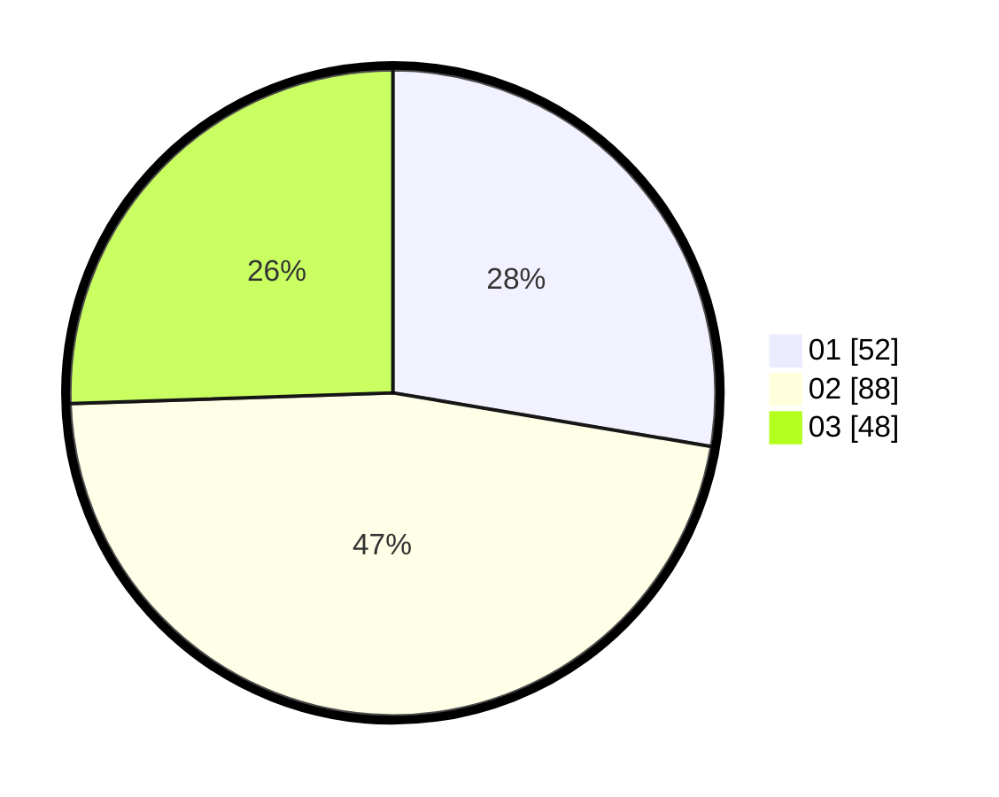

# Hasil

Hasil perolehan suara paslon dapat dilihat pada file paslon-01.txt, paslon-02.txt, dan paslon-03.txt.

Jika tidak ada, artinya data tersebut belum ada pada SIREKAP.

## Perolehan Suara

 * Paslon 01: **52**.
 * Paslon 02: **88**.
 * Paslon 03: **48**.

## Foto C Plano

https://sirekap-obj-formc.kpu.go.id/241c/pemilu/ppwp/31/73/01/10/06/3173011006053-20240216-055647--1f70c8d7-05d5-4ff1-8911-65891480ffeb.jpg

https://sirekap-obj-formc.kpu.go.id/241c/pemilu/ppwp/31/73/01/10/06/3173011006053-20240216-055650--e93ccea5-38df-4a5b-8480-df4791b08cda.jpg

https://sirekap-obj-formc.kpu.go.id/241c/pemilu/ppwp/31/73/01/10/06/3173011006053-20240216-055649--544cfe0e-ae03-4703-9d97-e8f0b6902adf.jpg

## DATA PEMILIH TETAP

Jumlah pemilih dalam DPT: **281**.
 * L: **142**.
 * P: **139**.

## DATA PENGGUNA HAK PILIH

Jumlah pengguna hak pilih dalam DPT: **180**.
 * L: **86**.
 * P: **94**.

Jumlah pengguna hak pilih dalam DPTb: **4**.
 * L: **2**.
 * P: **2**.

Jumlah pengguna hak pilih dalam DPK: **4**.
 * L: **2**.
 * P: **2**.

Jumlah pengguna hak pilih: **188**.
 * L: **90**.
 * P: **98**.

## JUMLAH SUARA SAH DAN TIDAK SAH

JUMLAH SELURUH SUARA SAH: **188**.

JUMLAH SUARA TIDAK SAH: **0**.

JUMLAH SELURUH SUARA SAH DAN SUARA TIDAK SAH: **188**.
