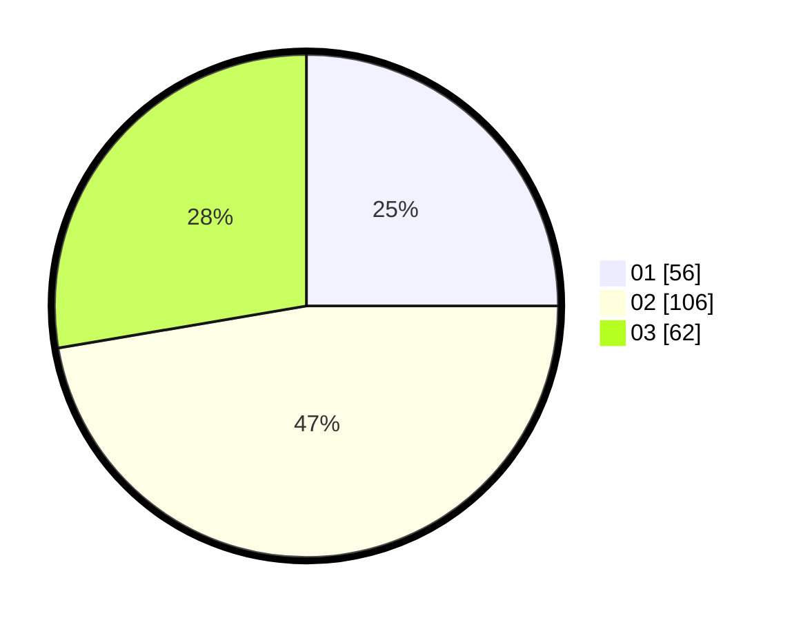

# Hasil

Hasil perolehan suara paslon dapat dilihat pada file paslon-01.txt, paslon-02.txt, dan paslon-03.txt.

Jika tidak ada, artinya data tersebut belum ada pada SIREKAP.

## Perolehan Suara

 * Paslon 01: **56**.
 * Paslon 02: **106**.
 * Paslon 03: **62**.

## Foto C Plano

https://sirekap-obj-formc.kpu.go.id/fdaf/pemilu/ppwp/31/73/01/10/06/3173011006055-20240214-194324--f3d4cf04-2790-46d8-804b-1554f22b24d9.jpg

https://sirekap-obj-formc.kpu.go.id/fdaf/pemilu/ppwp/31/73/01/10/06/3173011006055-20240214-194430--023dca56-46e0-4dca-a56c-430b935add42.jpg

https://sirekap-obj-formc.kpu.go.id/fdaf/pemilu/ppwp/31/73/01/10/06/3173011006055-20240214-234034--f5b5069b-215a-4fac-85d3-11cec4859fd3.jpg
