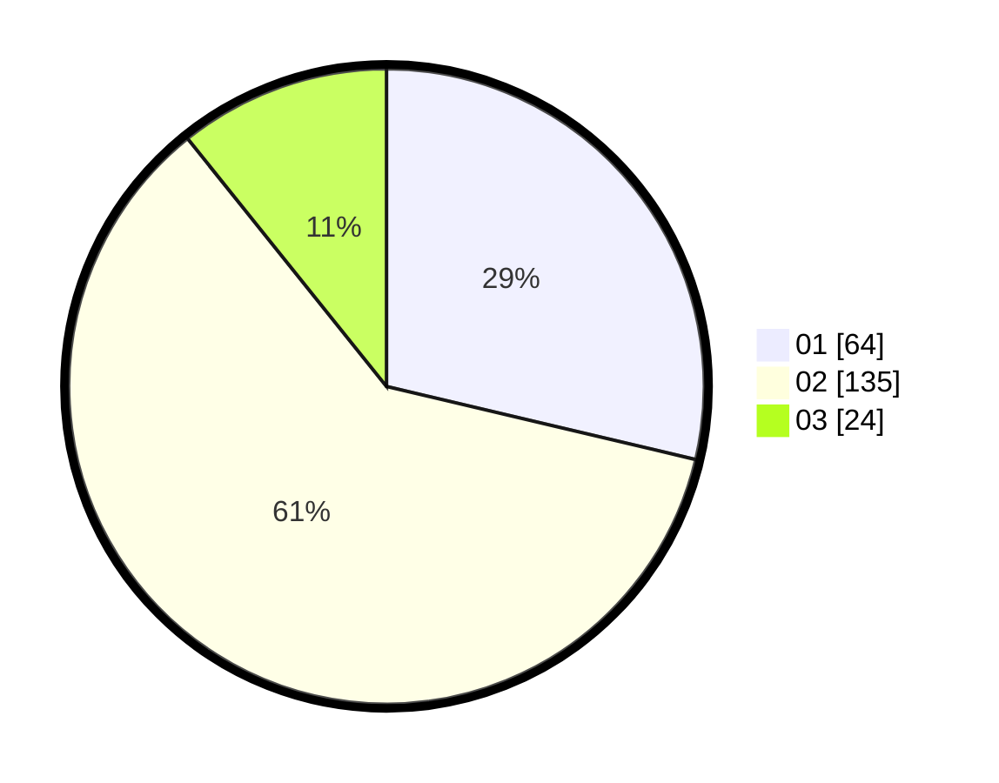

# Hasil

Hasil perolehan suara paslon dapat dilihat pada file paslon-01.txt, paslon-02.txt, dan paslon-03.txt.

Jika tidak ada, artinya data tersebut belum ada pada SIREKAP.

## Perolehan Suara

 * Paslon 01: **64**.
 * Paslon 02: **135**.
 * Paslon 03: **24**.

## Foto C Plano

https://sirekap-obj-formc.kpu.go.id/b9fe/pemilu/ppwp/31/73/01/10/06/3173011006057-20240216-064311--ed490703-23be-4be8-9655-13eca636d808.jpg

https://sirekap-obj-formc.kpu.go.id/b9fe/pemilu/ppwp/31/73/01/10/06/3173011006057-20240216-071554--3e50449e-730a-4c76-a259-61681cefc50c.jpg

https://sirekap-obj-formc.kpu.go.id/b9fe/pemilu/ppwp/31/73/01/10/06/3173011006057-20240216-064316--4019758f-89d5-4e59-bec8-97bdcd8d1a77.jpg

## DATA PEMILIH TETAP

Jumlah pemilih dalam DPT: **277**.
 * L: **139**.
 * P: **138**.

## DATA PENGGUNA HAK PILIH

Jumlah pengguna hak pilih dalam DPT: **227**.
 * L: **109**.
 * P: **118**.

Jumlah pengguna hak pilih dalam DPTb: **0**.
 * L: **0**.
 * P: **0**.

Jumlah pengguna hak pilih dalam DPK: **1**.
 * L: **1**.
 * P: **0**.

Jumlah pengguna hak pilih: **228**.
 * L: **110**.
 * P: **118**.

## JUMLAH SUARA SAH DAN TIDAK SAH

JUMLAH SELURUH SUARA SAH: **223**.

JUMLAH SUARA TIDAK SAH: **5**.

JUMLAH SELURUH SUARA SAH DAN SUARA TIDAK SAH: **228**.
