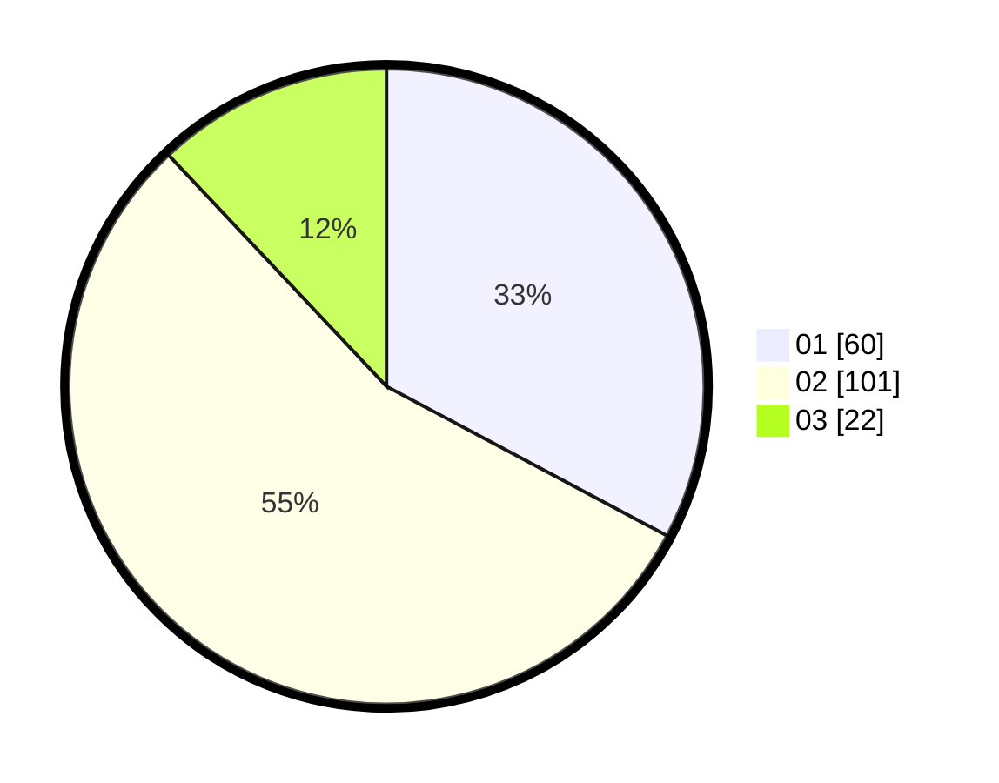

# Hasil

Hasil perolehan suara paslon dapat dilihat pada file paslon-01.txt, paslon-02.txt, dan paslon-03.txt.

Jika tidak ada, artinya data tersebut belum ada pada SIREKAP.

## Perolehan Suara

 * Paslon 01: **60**.
 * Paslon 02: **101**.
 * Paslon 03: **22**.

## Foto C Plano

https://sirekap-obj-formc.kpu.go.id/f2e6/pemilu/ppwp/31/73/01/10/06/3173011006060-20240214-233719--4832b15a-a481-4b7e-aff5-f3a3434cc1b3.jpg

https://sirekap-obj-formc.kpu.go.id/f2e6/pemilu/ppwp/31/73/01/10/06/3173011006060-20240214-234040--0438d7e6-ec8f-43ce-a77e-f961ddbcd1a0.jpg

https://sirekap-obj-formc.kpu.go.id/f2e6/pemilu/ppwp/31/73/01/10/06/3173011006060-20240214-234536--2b78bbae-f997-4949-baf1-bdbc4bfdcaa0.jpg
