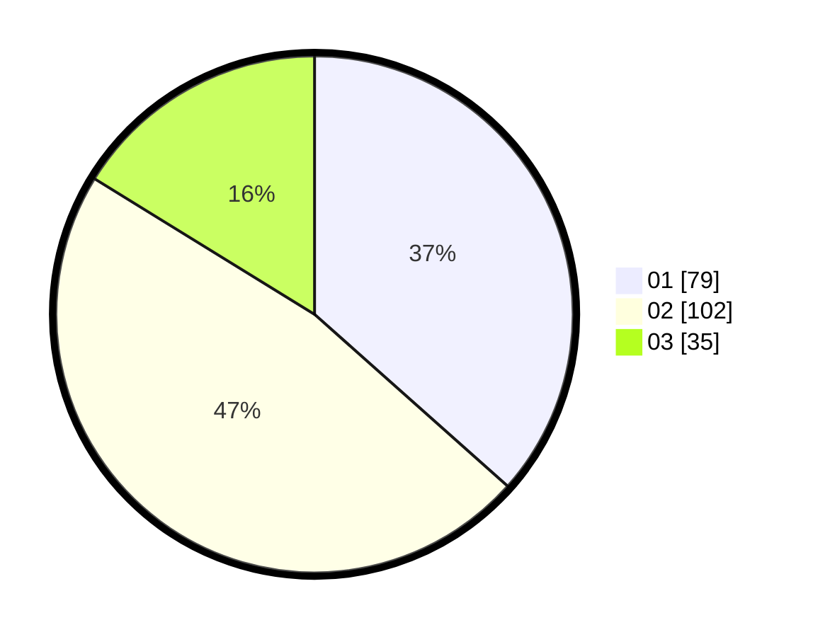

# Hasil

Hasil perolehan suara paslon dapat dilihat pada file paslon-01.txt, paslon-02.txt, dan paslon-03.txt.

Jika tidak ada, artinya data tersebut belum ada pada SIREKAP.

## Perolehan Suara

 * Paslon 01: **79**.
 * Paslon 02: **102**.
 * Paslon 03: **35**.

## Foto C Plano

https://sirekap-obj-formc.kpu.go.id/50c7/pemilu/ppwp/31/73/01/10/06/3173011006063-20240215-215939--fce7f50e-86a9-4d8d-afe8-cb68e1e237ea.jpg

https://sirekap-obj-formc.kpu.go.id/50c7/pemilu/ppwp/31/73/01/10/06/3173011006063-20240215-215941--e06c422c-d047-4582-9f55-1cd033dcf24d.jpg

https://sirekap-obj-formc.kpu.go.id/50c7/pemilu/ppwp/31/73/01/10/06/3173011006063-20240215-215940--b78de89d-9799-46c4-952b-41554540e5f6.jpg

## DATA PEMILIH TETAP

Jumlah pemilih dalam DPT: **283**.
 * L: **142**.
 * P: **141**.

## DATA PENGGUNA HAK PILIH

Jumlah pengguna hak pilih dalam DPT: **223**.
 * L: **110**.
 * P: **113**.

Jumlah pengguna hak pilih dalam DPTb: **0**.
 * L: **0**.
 * P: **0**.

Jumlah pengguna hak pilih dalam DPK: **2**.
 * L: **1**.
 * P: **1**.

Jumlah pengguna hak pilih: **225**.
 * L: **111**.
 * P: **114**.

## JUMLAH SUARA SAH DAN TIDAK SAH

JUMLAH SELURUH SUARA SAH: **216**.

JUMLAH SUARA TIDAK SAH: **7**.

JUMLAH SELURUH SUARA SAH DAN SUARA TIDAK SAH: **223**.
