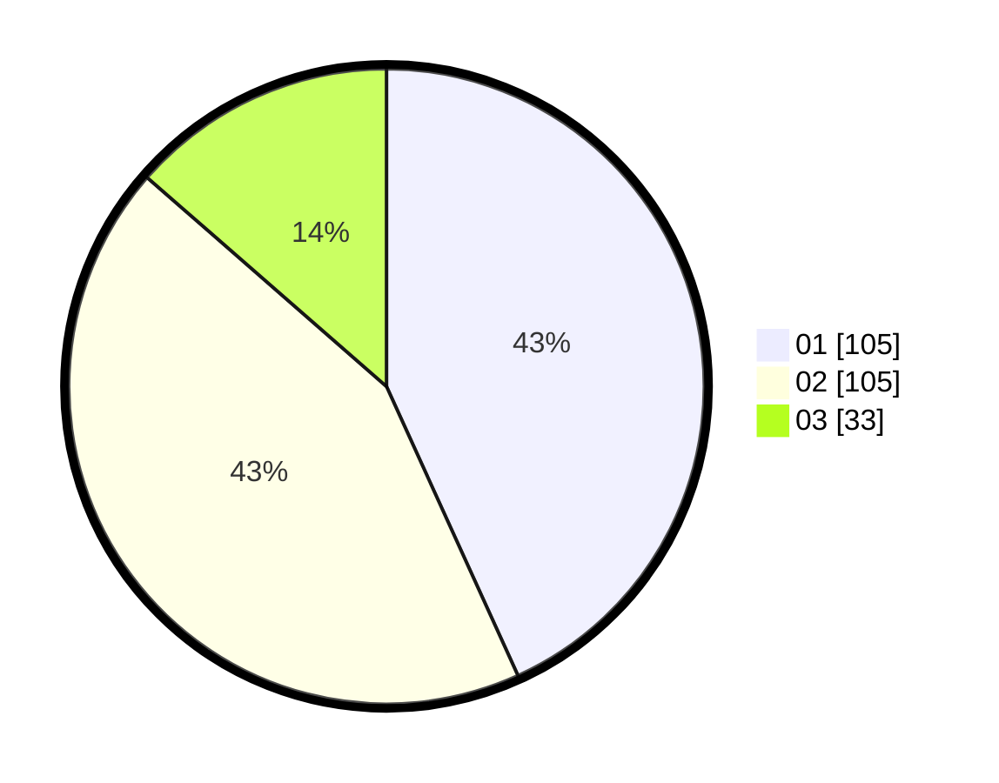

# Hasil

Hasil perolehan suara paslon dapat dilihat pada file paslon-01.txt, paslon-02.txt, dan paslon-03.txt.

Jika tidak ada, artinya data tersebut belum ada pada SIREKAP.

## Perolehan Suara

 * Paslon 01: **105**.
 * Paslon 02: **105**.
 * Paslon 03: **33**.

## Foto C Plano

https://sirekap-obj-formc.kpu.go.id/6b5d/pemilu/ppwp/31/73/01/10/06/3173011006066-20240214-220140--f3ca74a5-0580-48f4-98c4-b7125e4dedb5.jpg

https://sirekap-obj-formc.kpu.go.id/6b5d/pemilu/ppwp/31/73/01/10/06/3173011006066-20240214-220359--6f531c57-75e3-4535-87a0-4387166483c7.jpg

https://sirekap-obj-formc.kpu.go.id/6b5d/pemilu/ppwp/31/73/01/10/06/3173011006066-20240214-220543--c1e2d7cd-e96a-4b7b-810e-e36bcebcee26.jpg
