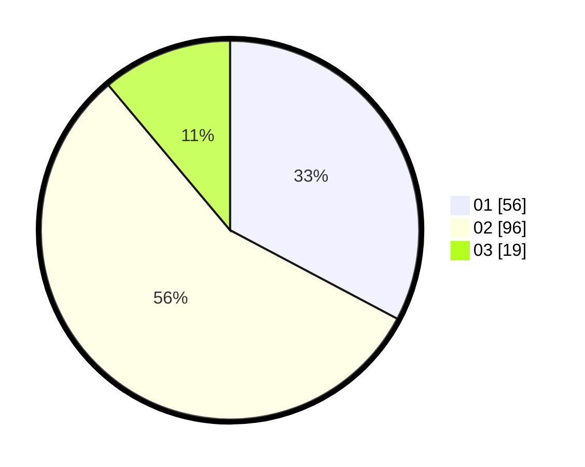

# Hasil

Hasil perolehan suara paslon dapat dilihat pada file paslon-01.txt, paslon-02.txt, dan paslon-03.txt.

Jika tidak ada, artinya data tersebut belum ada pada SIREKAP.

## Perolehan Suara

 * Paslon 01: **56**.
 * Paslon 02: **96**.
 * Paslon 03: **19**.

## Foto C Plano

https://sirekap-obj-formc.kpu.go.id/cf9a/pemilu/ppwp/31/73/01/10/06/3173011006068-20240215-212422--9d2704b7-e150-49fc-9b91-8992221d1c49.jpg

https://sirekap-obj-formc.kpu.go.id/cf9a/pemilu/ppwp/31/73/01/10/06/3173011006068-20240215-212424--754c94be-3981-49af-939f-44bc70f04509.jpg

https://sirekap-obj-formc.kpu.go.id/cf9a/pemilu/ppwp/31/73/01/10/06/3173011006068-20240215-212423--23f35a6e-5ebf-46de-878f-2e7e3bfb2837.jpg

## DATA PEMILIH TETAP

Jumlah pemilih dalam DPT: **236**.
 * L: **110**.
 * P: **126**.

## DATA PENGGUNA HAK PILIH

Jumlah pengguna hak pilih dalam DPT: **171**.
 * L: **73**.
 * P: **98**.

Jumlah pengguna hak pilih dalam DPTb: **0**.
 * L: **0**.
 * P: **0**.

Jumlah pengguna hak pilih dalam DPK: **0**.
 * L: **0**.
 * P: **0**.

Jumlah pengguna hak pilih: **171**.
 * L: **73**.
 * P: **98**.

## JUMLAH SUARA SAH DAN TIDAK SAH

JUMLAH SELURUH SUARA SAH: **171**.

JUMLAH SUARA TIDAK SAH: **0**.

JUMLAH SELURUH SUARA SAH DAN SUARA TIDAK SAH: **171**.
