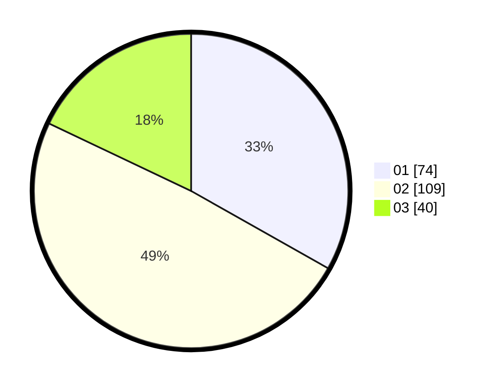

# Hasil

Hasil perolehan suara paslon dapat dilihat pada file paslon-01.txt, paslon-02.txt, dan paslon-03.txt.

Jika tidak ada, artinya data tersebut belum ada pada SIREKAP.

## Perolehan Suara

 * Paslon 01: **74**.
 * Paslon 02: **109**.
 * Paslon 03: **40**.

## Foto C Plano

https://sirekap-obj-formc.kpu.go.id/69e1/pemilu/ppwp/31/73/01/10/06/3173011006074-20240216-141903--e8eb9fdb-ac82-4858-b1f8-6dc17ff546e3.jpg

https://sirekap-obj-formc.kpu.go.id/69e1/pemilu/ppwp/31/73/01/10/06/3173011006074-20240214-191313--da411405-f50b-4f9d-9693-a429fb3a0de3.jpg

https://sirekap-obj-formc.kpu.go.id/69e1/pemilu/ppwp/31/73/01/10/06/3173011006074-20240214-155816--ca2bea97-d72d-4db2-97d6-872d31b2e526.jpg

## DATA PEMILIH TETAP

Jumlah pemilih dalam DPT: **278**.
 * L: **139**.
 * P: **139**.

## DATA PENGGUNA HAK PILIH

Jumlah pengguna hak pilih dalam DPT: **227**.
 * L: **110**.
 * P: **117**.

Jumlah pengguna hak pilih dalam DPTb: **0**.
 * L: **0**.
 * P: **0**.

Jumlah pengguna hak pilih dalam DPK: **0**.
 * L: **0**.
 * P: **0**.

Jumlah pengguna hak pilih: **227**.
 * L: **110**.
 * P: **117**.

## JUMLAH SUARA SAH DAN TIDAK SAH

JUMLAH SELURUH SUARA SAH: **223**.

JUMLAH SUARA TIDAK SAH: **4**.

JUMLAH SELURUH SUARA SAH DAN SUARA TIDAK SAH: **227**.
