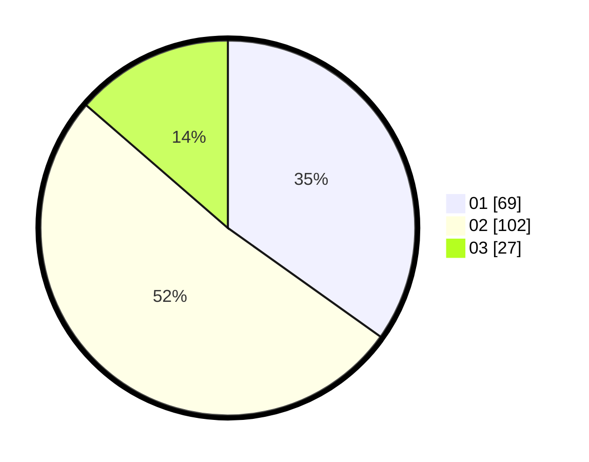

# Hasil

Hasil perolehan suara paslon dapat dilihat pada file paslon-01.txt, paslon-02.txt, dan paslon-03.txt.

Jika tidak ada, artinya data tersebut belum ada pada SIREKAP.

## Perolehan Suara

 * Paslon 01: **69**.
 * Paslon 02: **102**.
 * Paslon 03: **27**.

## Foto C Plano

https://sirekap-obj-formc.kpu.go.id/0124/pemilu/ppwp/31/73/01/10/06/3173011006081-20240214-230727--6089dae6-a56f-43b0-8589-a0f029df9921.jpg

https://sirekap-obj-formc.kpu.go.id/0124/pemilu/ppwp/31/73/01/10/06/3173011006081-20240214-230928--e1ffc166-143d-4e5f-8fa6-8672db548736.jpg

https://sirekap-obj-formc.kpu.go.id/0124/pemilu/ppwp/31/73/01/10/06/3173011006081-20240214-231148--fab90b81-8046-46e8-b883-edd23f5069eb.jpg
