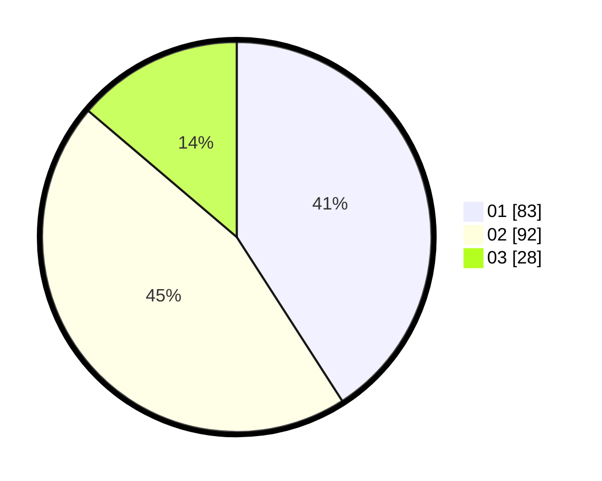

# Hasil

Hasil perolehan suara paslon dapat dilihat pada file paslon-01.txt, paslon-02.txt, dan paslon-03.txt.

Jika tidak ada, artinya data tersebut belum ada pada SIREKAP.

## Perolehan Suara

 * Paslon 01: **83**.
 * Paslon 02: **92**.
 * Paslon 03: **28**.

## Foto C Plano

https://sirekap-obj-formc.kpu.go.id/907e/pemilu/ppwp/31/73/01/10/06/3173011006091-20240214-212137--f135f992-43fd-4074-a81f-e5c0d9e0d9a4.jpg

https://sirekap-obj-formc.kpu.go.id/907e/pemilu/ppwp/31/73/01/10/06/3173011006091-20240214-212110--9db58865-0a39-495a-8a32-a8e530177dc6.jpg

https://sirekap-obj-formc.kpu.go.id/907e/pemilu/ppwp/31/73/01/10/06/3173011006091-20240214-212237--ebedda26-6b34-40dc-b34f-74de4374c26f.jpg

## DATA PEMILIH TETAP

Jumlah pemilih dalam DPT: **281**.
 * L: **137**.
 * P: **144**.

## DATA PENGGUNA HAK PILIH

Jumlah pengguna hak pilih dalam DPT: **215**.
 * L: **102**.
 * P: **113**.

Jumlah pengguna hak pilih dalam DPTb: **0**.
 * L: **0**.
 * P: **0**.

Jumlah pengguna hak pilih dalam DPK: **2**.
 * L: **2**.
 * P: **0**.

Jumlah pengguna hak pilih: **217**.
 * L: **104**.
 * P: **113**.

## JUMLAH SUARA SAH DAN TIDAK SAH

JUMLAH SELURUH SUARA SAH: **203**.

JUMLAH SUARA TIDAK SAH: **16**.

JUMLAH SELURUH SUARA SAH DAN SUARA TIDAK SAH: **219**.
