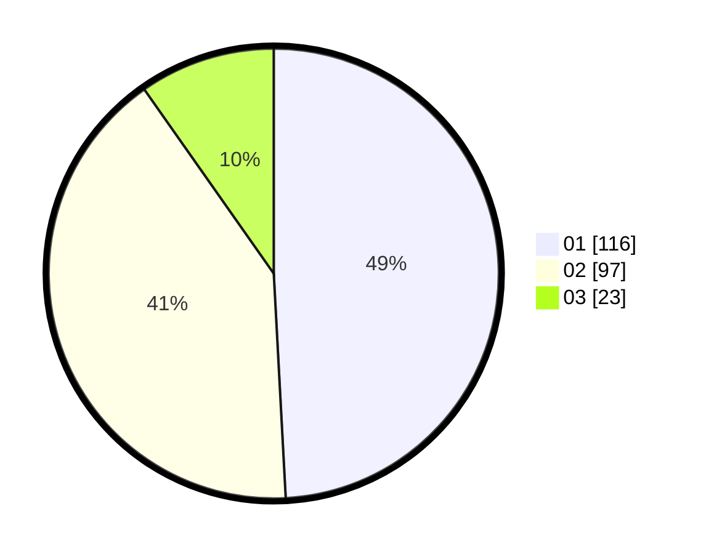

# Hasil

Hasil perolehan suara paslon dapat dilihat pada file paslon-01.txt, paslon-02.txt, dan paslon-03.txt.

Jika tidak ada, artinya data tersebut belum ada pada SIREKAP.

## Perolehan Suara

 * Paslon 01: **116**.
 * Paslon 02: **97**.
 * Paslon 03: **23**.

## Foto C Plano

https://sirekap-obj-formc.kpu.go.id/a216/pemilu/ppwp/31/73/01/10/06/3173011006093-20240215-220756--db692ac6-dd1c-4acc-9623-c080dd36ae83.jpg

https://sirekap-obj-formc.kpu.go.id/a216/pemilu/ppwp/31/73/01/10/06/3173011006093-20240215-085931--d50ec3d8-331c-4fce-8e71-7e7377d91c51.jpg

https://sirekap-obj-formc.kpu.go.id/a216/pemilu/ppwp/31/73/01/10/06/3173011006093-20240215-220339--09aec43b-afb8-4461-bdfe-686c53b83e04.jpg
