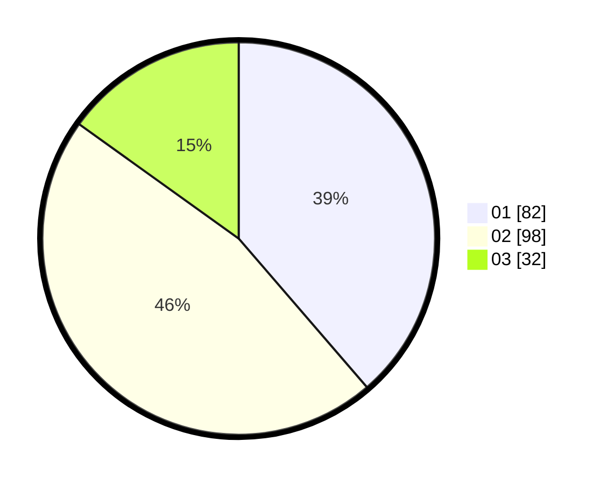

# Hasil

Hasil perolehan suara paslon dapat dilihat pada file paslon-01.txt, paslon-02.txt, dan paslon-03.txt.

Jika tidak ada, artinya data tersebut belum ada pada SIREKAP.

## Perolehan Suara

 * Paslon 01: **82**.
 * Paslon 02: **98**.
 * Paslon 03: **32**.

## Foto C Plano

https://sirekap-obj-formc.kpu.go.id/af4c/pemilu/ppwp/31/73/01/10/06/3173011006098-20240215-163036--17a847f1-06c3-474a-a08b-84007b55ada7.jpg

https://sirekap-obj-formc.kpu.go.id/af4c/pemilu/ppwp/31/73/01/10/06/3173011006098-20240215-163402--0d217d08-6a7a-4782-bd82-7dff1068ad7c.jpg
