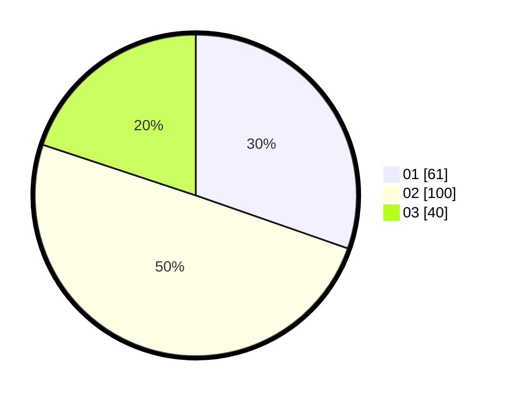

# Hasil

Hasil perolehan suara paslon dapat dilihat pada file paslon-01.txt, paslon-02.txt, dan paslon-03.txt.

Jika tidak ada, artinya data tersebut belum ada pada SIREKAP.

## Perolehan Suara

 * Paslon 01: **61**.
 * Paslon 02: **100**.
 * Paslon 03: **40**.

## Foto C Plano

https://sirekap-obj-formc.kpu.go.id/eb48/pemilu/ppwp/31/73/01/10/06/3173011006109-20240219-143623--fbe021c7-82dd-4f41-8f35-a82dfa4fb2d3.jpg

https://sirekap-obj-formc.kpu.go.id/eb48/pemilu/ppwp/31/73/01/10/06/3173011006109-20240215-165353--a46bb27f-29fe-44bf-a33b-f116520b12e6.jpg

https://sirekap-obj-formc.kpu.go.id/eb48/pemilu/ppwp/31/73/01/10/06/3173011006109-20240215-165438--32948fcc-adec-4a17-9493-bd57fca04ee8.jpg
