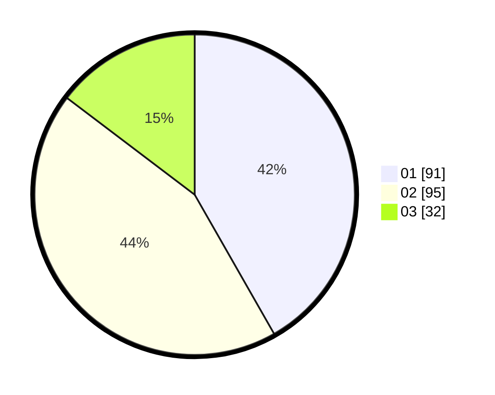

# Hasil

Hasil perolehan suara paslon dapat dilihat pada file paslon-01.txt, paslon-02.txt, dan paslon-03.txt.

Jika tidak ada, artinya data tersebut belum ada pada SIREKAP.

## Perolehan Suara

 * Paslon 01: **91**.
 * Paslon 02: **95**.
 * Paslon 03: **32**.

## Foto C Plano

https://sirekap-obj-formc.kpu.go.id/b288/pemilu/ppwp/31/73/01/10/06/3173011006111-20240215-013605--6e8d5a04-6839-4d69-b2fe-771aec98ab72.jpg

https://sirekap-obj-formc.kpu.go.id/b288/pemilu/ppwp/31/73/01/10/06/3173011006111-20240215-015259--89b91a4a-1fef-4efc-85d3-a7def5a3683e.jpg

https://sirekap-obj-formc.kpu.go.id/b288/pemilu/ppwp/31/73/01/10/06/3173011006111-20240215-014005--db55661b-ad7e-4937-bfe7-cc58681559e3.jpg
