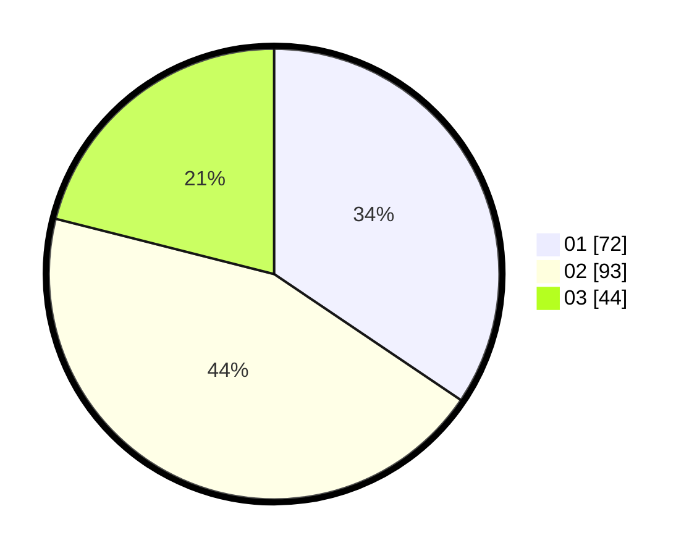

# Hasil

Hasil perolehan suara paslon dapat dilihat pada file paslon-01.txt, paslon-02.txt, dan paslon-03.txt.

Jika tidak ada, artinya data tersebut belum ada pada SIREKAP.

## Perolehan Suara

 * Paslon 01: **72**.
 * Paslon 02: **93**.
 * Paslon 03: **44**.

## Foto C Plano

https://sirekap-obj-formc.kpu.go.id/776c/pemilu/ppwp/31/73/01/10/06/3173011006115-20240216-154049--18008530-1a2e-4194-9905-5f5ab390b001.jpg

https://sirekap-obj-formc.kpu.go.id/776c/pemilu/ppwp/31/73/01/10/06/3173011006115-20240216-154051--e7ab7c55-75b6-4d87-8107-84759f2b603a.jpg

https://sirekap-obj-formc.kpu.go.id/776c/pemilu/ppwp/31/73/01/10/06/3173011006115-20240216-154050--a0f3c12d-e38f-4ccd-a7ee-853273c56db5.jpg

## DATA PEMILIH TETAP

Jumlah pemilih dalam DPT: **288**.
 * L: **141**.
 * P: **147**.

## DATA PENGGUNA HAK PILIH

Jumlah pengguna hak pilih dalam DPT: **288**.
 * L: **141**.
 * P: **147**.

Jumlah pengguna hak pilih dalam DPTb: **0**.
 * L: **0**.
 * P: **0**.

Jumlah pengguna hak pilih dalam DPK: **0**.
 * L: **0**.
 * P: **0**.

Jumlah pengguna hak pilih: **288**.
 * L: **141**.
 * P: **147**.

## JUMLAH SUARA SAH DAN TIDAK SAH

JUMLAH SELURUH SUARA SAH: **209**.

JUMLAH SUARA TIDAK SAH: **4**.

JUMLAH SELURUH SUARA SAH DAN SUARA TIDAK SAH: **213**.
