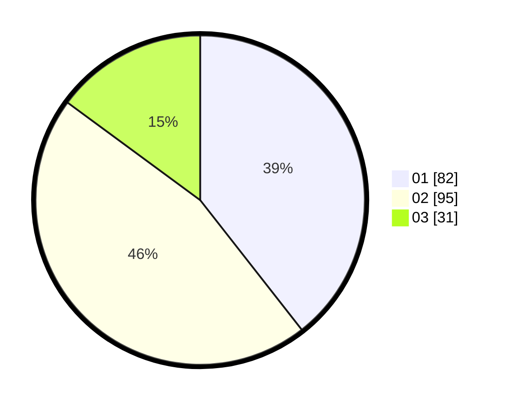

# Hasil

Hasil perolehan suara paslon dapat dilihat pada file paslon-01.txt, paslon-02.txt, dan paslon-03.txt.

Jika tidak ada, artinya data tersebut belum ada pada SIREKAP.

## Perolehan Suara

 * Paslon 01: **82**.
 * Paslon 02: **95**.
 * Paslon 03: **31**.

## Foto C Plano

https://sirekap-obj-formc.kpu.go.id/6f41/pemilu/ppwp/31/73/01/10/06/3173011006119-20240215-002536--0386af10-2f95-44af-8ddc-6b5f54b2ff76.jpg

https://sirekap-obj-formc.kpu.go.id/6f41/pemilu/ppwp/31/73/01/10/06/3173011006119-20240215-002655--e661c2d5-0fd5-49ab-a86f-2f1227440c2d.jpg

https://sirekap-obj-formc.kpu.go.id/6f41/pemilu/ppwp/31/73/01/10/06/3173011006119-20240215-002737--4d3fe054-334c-49df-a6df-e28199f36fe6.jpg
