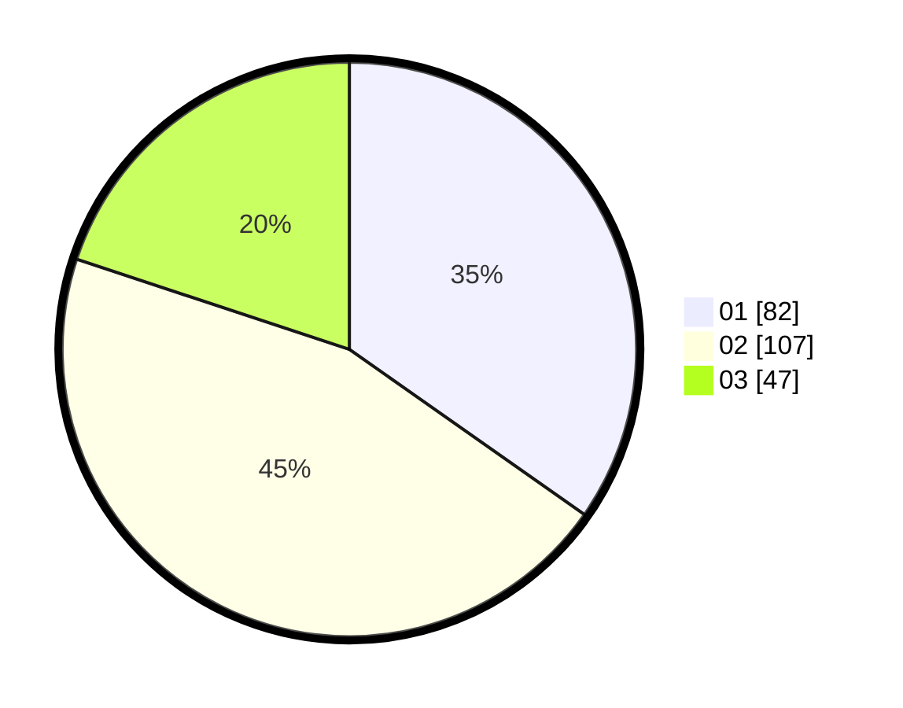

# Hasil

Hasil perolehan suara paslon dapat dilihat pada file paslon-01.txt, paslon-02.txt, dan paslon-03.txt.

Jika tidak ada, artinya data tersebut belum ada pada SIREKAP.

## Perolehan Suara

 * Paslon 01: **82**.
 * Paslon 02: **107**.
 * Paslon 03: **47**.

## Foto C Plano

https://sirekap-obj-formc.kpu.go.id/cf11/pemilu/ppwp/31/73/01/10/06/3173011006121-20240214-232558--cdc2273b-9104-4f2c-ab87-7dca6fa98603.jpg

https://sirekap-obj-formc.kpu.go.id/cf11/pemilu/ppwp/31/73/01/10/06/3173011006121-20240214-225802--8b5ddfaa-39c7-4699-90f5-f6fd6aac14ee.jpg

https://sirekap-obj-formc.kpu.go.id/cf11/pemilu/ppwp/31/73/01/10/06/3173011006121-20240214-234022--e064e6dd-0b56-4655-9fe8-4a93442b3c80.jpg
