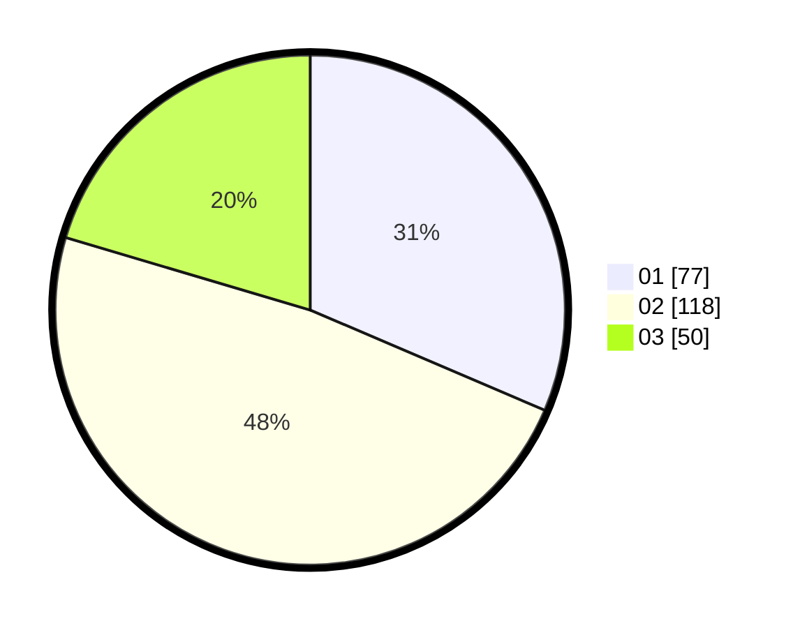

# Hasil

Hasil perolehan suara paslon dapat dilihat pada file paslon-01.txt, paslon-02.txt, dan paslon-03.txt.

Jika tidak ada, artinya data tersebut belum ada pada SIREKAP.

## Perolehan Suara

 * Paslon 01: **77**.
 * Paslon 02: **118**.
 * Paslon 03: **50**.

## Foto C Plano

https://sirekap-obj-formc.kpu.go.id/a9d8/pemilu/ppwp/31/73/01/10/06/3173011006123-20240216-145605--55813dc6-885e-43d9-accf-651051bd13a6.jpg

https://sirekap-obj-formc.kpu.go.id/a9d8/pemilu/ppwp/31/73/01/10/06/3173011006123-20240216-145606--b138ba14-74dc-4206-b6c5-4376ae83883a.jpg

https://sirekap-obj-formc.kpu.go.id/a9d8/pemilu/ppwp/31/73/01/10/06/3173011006123-20240216-145605--a57f3fc9-3ab8-4447-a5ae-1d15e2b8a535.jpg

## DATA PEMILIH TETAP

Jumlah pemilih dalam DPT: **291**.
 * L: **136**.
 * P: **155**.

## DATA PENGGUNA HAK PILIH

Jumlah pengguna hak pilih dalam DPT: **237**.
 * L: **103**.
 * P: **134**.

Jumlah pengguna hak pilih dalam DPTb: **9**.
 * L: **4**.
 * P: **5**.

Jumlah pengguna hak pilih dalam DPK: **0**.
 * L: **0**.
 * P: **0**.

Jumlah pengguna hak pilih: **246**.
 * L: **107**.
 * P: **139**.

## JUMLAH SUARA SAH DAN TIDAK SAH

JUMLAH SELURUH SUARA SAH: **245**.

JUMLAH SUARA TIDAK SAH: **1**.

JUMLAH SELURUH SUARA SAH DAN SUARA TIDAK SAH: **246**.
