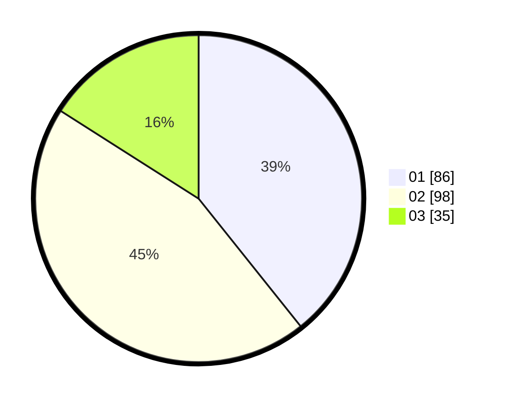

# Hasil

Hasil perolehan suara paslon dapat dilihat pada file paslon-01.txt, paslon-02.txt, dan paslon-03.txt.

Jika tidak ada, artinya data tersebut belum ada pada SIREKAP.

## Perolehan Suara

 * Paslon 01: **86**.
 * Paslon 02: **98**.
 * Paslon 03: **35**.

## Foto C Plano

https://sirekap-obj-formc.kpu.go.id/ef91/pemilu/ppwp/31/73/01/10/06/3173011006125-20240214-201933--2d556eb6-069f-4316-acc5-00bd9d9425cf.jpg

https://sirekap-obj-formc.kpu.go.id/ef91/pemilu/ppwp/31/73/01/10/06/3173011006125-20240214-202150--50c73ac1-bdbc-44c1-8beb-e532c281bc07.jpg
