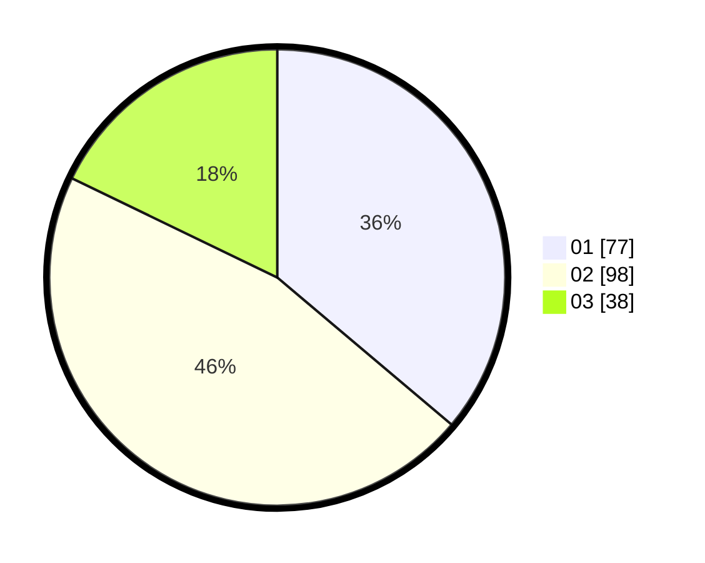

# Hasil

Hasil perolehan suara paslon dapat dilihat pada file paslon-01.txt, paslon-02.txt, dan paslon-03.txt.

Jika tidak ada, artinya data tersebut belum ada pada SIREKAP.

## Perolehan Suara

 * Paslon 01: **77**.
 * Paslon 02: **98**.
 * Paslon 03: **38**.

## Foto C Plano

https://sirekap-obj-formc.kpu.go.id/cdde/pemilu/ppwp/31/73/01/10/06/3173011006126-20240214-235726--173f0f79-25ec-442d-a936-b4256a2215ae.jpg

https://sirekap-obj-formc.kpu.go.id/cdde/pemilu/ppwp/31/73/01/10/06/3173011006126-20240214-235847--59998e54-ecf3-4e53-8fbb-045630e287e1.jpg

https://sirekap-obj-formc.kpu.go.id/cdde/pemilu/ppwp/31/73/01/10/06/3173011006126-20240215-000011--50c4cd4f-67ab-4779-a2c7-63fbe63f0ac7.jpg
