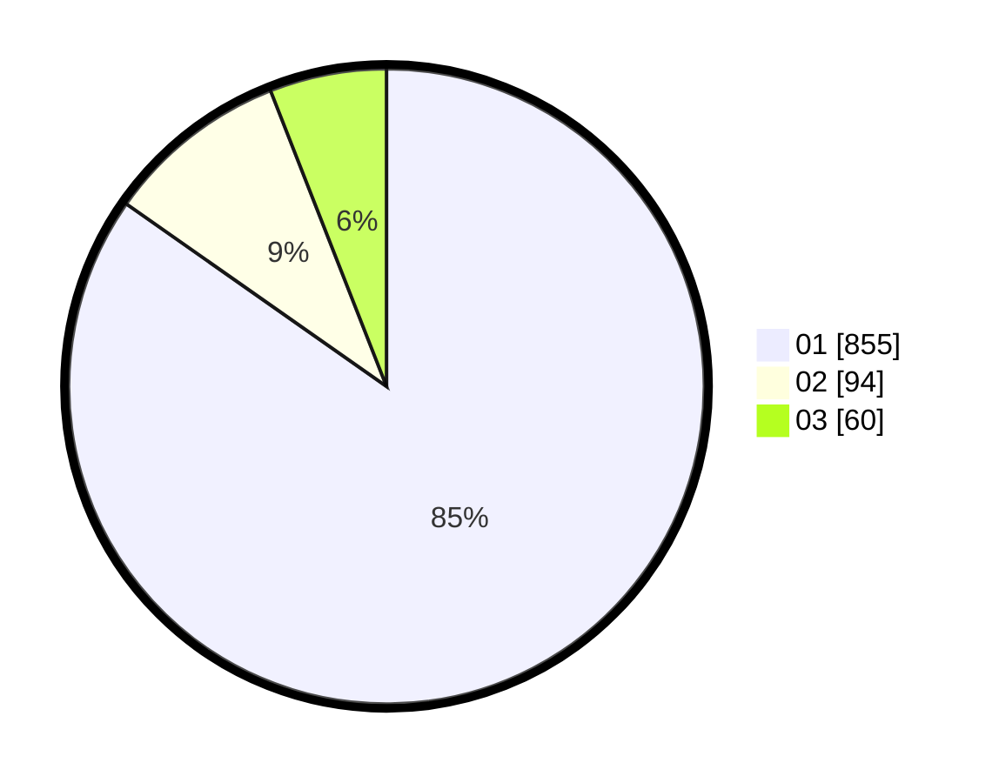

# Hasil

Hasil perolehan suara paslon dapat dilihat pada file paslon-01.txt, paslon-02.txt, dan paslon-03.txt.

Jika tidak ada, artinya data tersebut belum ada pada SIREKAP.

## Perolehan Suara

 * Paslon 01: **855**.
 * Paslon 02: **94**.
 * Paslon 03: **60**.

## Foto C Plano

https://sirekap-obj-formc.kpu.go.id/ec4f/pemilu/ppwp/31/73/01/10/06/3173011006127-20240216-073115--7009fcee-a082-4221-946e-f7df6ad0738e.jpg

https://sirekap-obj-formc.kpu.go.id/ec4f/pemilu/ppwp/31/73/01/10/06/3173011006127-20240216-073116--edfe4127-6968-40cc-8d03-f29943c8c05d.jpg

https://sirekap-obj-formc.kpu.go.id/ec4f/pemilu/ppwp/31/73/01/10/06/3173011006127-20240216-073116--e5a70153-5337-44eb-8e6d-19a677065628.jpg

## DATA PEMILIH TETAP

Jumlah pemilih dalam DPT: **237**.
 * L: **109**.
 * P: **128**.

## DATA PENGGUNA HAK PILIH

Jumlah pengguna hak pilih dalam DPT: **237**.
 * L: **109**.
 * P: **128**.

Jumlah pengguna hak pilih dalam DPTb: **0**.
 * L: **0**.
 * P: **0**.

Jumlah pengguna hak pilih dalam DPK: **5**.
 * L: **2**.
 * P: **3**.

Jumlah pengguna hak pilih: **242**.
 * L: **111**.
 * P: **131**.

## JUMLAH SUARA SAH DAN TIDAK SAH

JUMLAH SELURUH SUARA SAH: **239**.

JUMLAH SUARA TIDAK SAH: **3**.

JUMLAH SELURUH SUARA SAH DAN SUARA TIDAK SAH: **242**.
