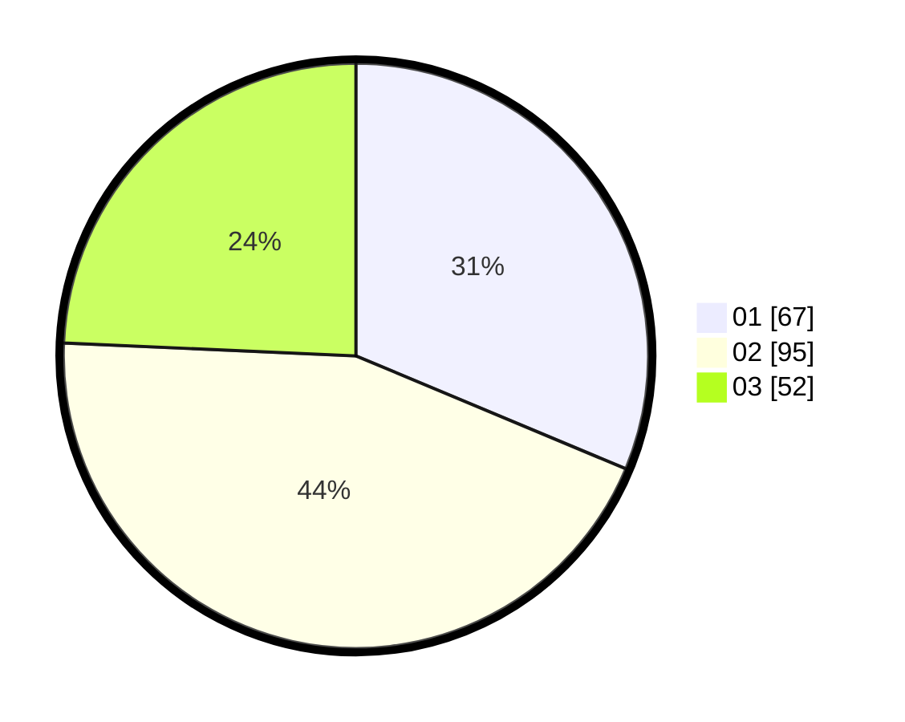

# Hasil

Hasil perolehan suara paslon dapat dilihat pada file paslon-01.txt, paslon-02.txt, dan paslon-03.txt.

Jika tidak ada, artinya data tersebut belum ada pada SIREKAP.

## Perolehan Suara

 * Paslon 01: **67**.
 * Paslon 02: **95**.
 * Paslon 03: **52**.

## Foto C Plano

https://sirekap-obj-formc.kpu.go.id/5398/pemilu/ppwp/31/73/01/10/06/3173011006128-20240215-234208--ddb507b4-0ff3-47f4-8a70-b04b7d847012.jpg

https://sirekap-obj-formc.kpu.go.id/5398/pemilu/ppwp/31/73/01/10/06/3173011006128-20240215-234036--2535fe5f-c5e0-468a-9c0f-859c4bd4d46f.jpg

https://sirekap-obj-formc.kpu.go.id/5398/pemilu/ppwp/31/73/01/10/06/3173011006128-20240215-234034--7eab7c35-cf38-40be-8064-9fbc44cea224.jpg

## DATA PEMILIH TETAP

Jumlah pemilih dalam DPT: **287**.
 * L: **137**.
 * P: **150**.

## DATA PENGGUNA HAK PILIH

Jumlah pengguna hak pilih dalam DPT: **214**.
 * L: **95**.
 * P: **119**.

Jumlah pengguna hak pilih dalam DPTb: **0**.
 * L: **0**.
 * P: **0**.

Jumlah pengguna hak pilih dalam DPK: **2**.
 * L: **0**.
 * P: **2**.

Jumlah pengguna hak pilih: **216**.
 * L: **95**.
 * P: **121**.

## JUMLAH SUARA SAH DAN TIDAK SAH

JUMLAH SELURUH SUARA SAH: **214**.

JUMLAH SUARA TIDAK SAH: **2**.

JUMLAH SELURUH SUARA SAH DAN SUARA TIDAK SAH: **216**.
