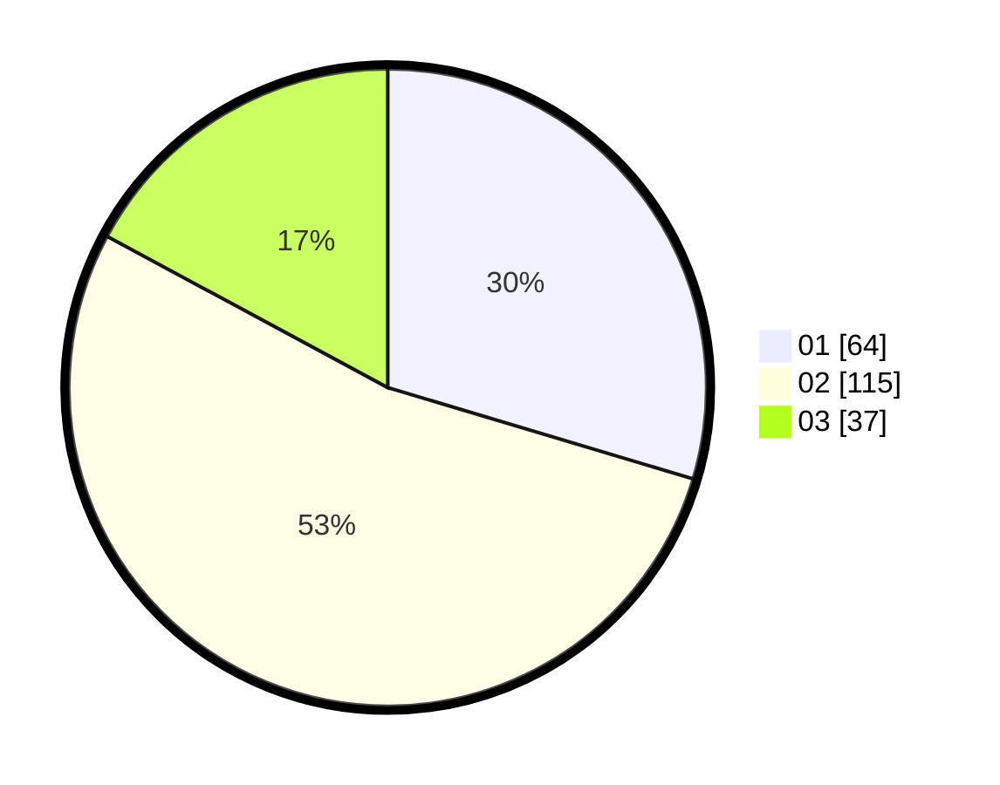

# Hasil

Hasil perolehan suara paslon dapat dilihat pada file paslon-01.txt, paslon-02.txt, dan paslon-03.txt.

Jika tidak ada, artinya data tersebut belum ada pada SIREKAP.

## Perolehan Suara

 * Paslon 01: **64**.
 * Paslon 02: **115**.
 * Paslon 03: **37**.

## Foto C Plano

https://sirekap-obj-formc.kpu.go.id/64db/pemilu/ppwp/31/73/01/10/06/3173011006130-20240216-033028--e7942a03-e805-482c-9e8c-09afaa1996a8.jpg

https://sirekap-obj-formc.kpu.go.id/64db/pemilu/ppwp/31/73/01/10/06/3173011006130-20240216-033040--ff621a08-cc17-43c5-afc5-04f21d217780.jpg

https://sirekap-obj-formc.kpu.go.id/64db/pemilu/ppwp/31/73/01/10/06/3173011006130-20240216-084225--a5838d1f-2558-459e-a941-a8c237fe89c6.jpg

## DATA PEMILIH TETAP

Jumlah pemilih dalam DPT: **295**.
 * L: **134**.
 * P: **161**.

## DATA PENGGUNA HAK PILIH

Jumlah pengguna hak pilih dalam DPT: **216**.
 * L: **92**.
 * P: **124**.

Jumlah pengguna hak pilih dalam DPTb: **3**.
 * L: **2**.
 * P: **1**.

Jumlah pengguna hak pilih dalam DPK: **0**.
 * L: **1**.
 * P: **0**.

Jumlah pengguna hak pilih: **220**.
 * L: **95**.
 * P: **125**.

## JUMLAH SUARA SAH DAN TIDAK SAH

JUMLAH SELURUH SUARA SAH: **216**.

JUMLAH SUARA TIDAK SAH: **1**.

JUMLAH SELURUH SUARA SAH DAN SUARA TIDAK SAH: **217**.
