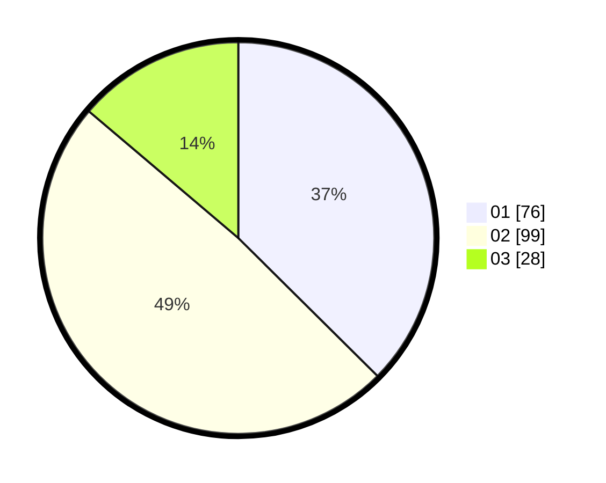

# Hasil

Hasil perolehan suara paslon dapat dilihat pada file paslon-01.txt, paslon-02.txt, dan paslon-03.txt.

Jika tidak ada, artinya data tersebut belum ada pada SIREKAP.

## Perolehan Suara

 * Paslon 01: **76**.
 * Paslon 02: **99**.
 * Paslon 03: **28**.

## Foto C Plano

https://sirekap-obj-formc.kpu.go.id/5624/pemilu/ppwp/31/73/01/10/06/3173011006132-20240216-141727--6904945c-947f-4d7b-9d30-28cb0cc6a581.jpg

https://sirekap-obj-formc.kpu.go.id/5624/pemilu/ppwp/31/73/01/10/06/3173011006132-20240216-141728--4cebeb69-18fc-47d7-8dfe-595f505d0092.jpg

https://sirekap-obj-formc.kpu.go.id/5624/pemilu/ppwp/31/73/01/10/06/3173011006132-20240216-141727--9db4410c-010a-4ab2-bc09-47ba9f276100.jpg

## DATA PEMILIH TETAP

Jumlah pemilih dalam DPT: **281**.
 * L: **129**.
 * P: **152**.

## DATA PENGGUNA HAK PILIH

Jumlah pengguna hak pilih dalam DPT: **194**.
 * L: **82**.
 * P: **112**.

Jumlah pengguna hak pilih dalam DPTb: **3**.
 * L: **1**.
 * P: **2**.

Jumlah pengguna hak pilih dalam DPK: **8**.
 * L: **4**.
 * P: **4**.

Jumlah pengguna hak pilih: **205**.
 * L: **87**.
 * P: **118**.

## JUMLAH SUARA SAH DAN TIDAK SAH

JUMLAH SELURUH SUARA SAH: **203**.

JUMLAH SUARA TIDAK SAH: **2**.

JUMLAH SELURUH SUARA SAH DAN SUARA TIDAK SAH: **205**.
