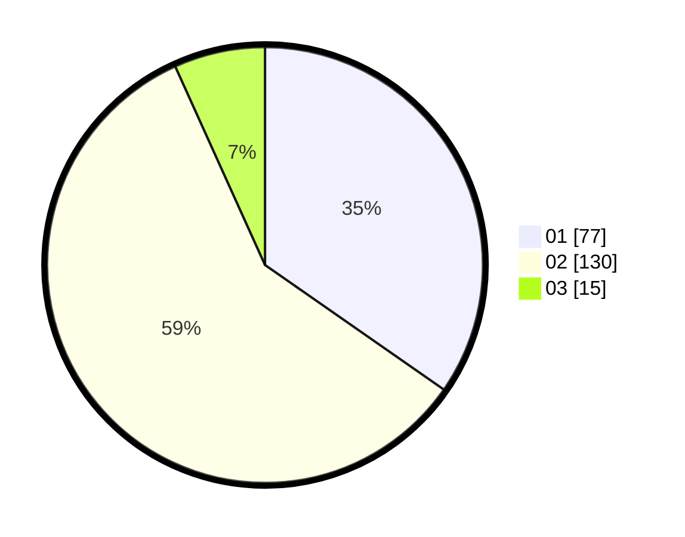

# Hasil

Hasil perolehan suara paslon dapat dilihat pada file paslon-01.txt, paslon-02.txt, dan paslon-03.txt.

Jika tidak ada, artinya data tersebut belum ada pada SIREKAP.

## Perolehan Suara

 * Paslon 01: **77**.
 * Paslon 02: **130**.
 * Paslon 03: **15**.

## Foto C Plano

https://sirekap-obj-formc.kpu.go.id/b07c/pemilu/ppwp/31/73/01/10/06/3173011006140-20240214-192023--26f4022b-5131-4e9a-88ef-0856788fecb5.jpg

https://sirekap-obj-formc.kpu.go.id/b07c/pemilu/ppwp/31/73/01/10/06/3173011006140-20240214-193045--f3a902cb-05d4-429c-8160-942d49f8ad20.jpg

https://sirekap-obj-formc.kpu.go.id/b07c/pemilu/ppwp/31/73/01/10/06/3173011006140-20240214-193254--94b53c68-d18a-4f3c-8983-adee357c359e.jpg

## DATA PEMILIH TETAP

Jumlah pemilih dalam DPT: **284**.
 * L: **139**.
 * P: **145**.

## DATA PENGGUNA HAK PILIH

Jumlah pengguna hak pilih dalam DPT: **220**.
 * L: **103**.
 * P: **117**.

Jumlah pengguna hak pilih dalam DPTb: **2**.
 * L: **1**.
 * P: **1**.

Jumlah pengguna hak pilih dalam DPK: **5**.
 * L: **1**.
 * P: **4**.

Jumlah pengguna hak pilih: **227**.
 * L: **105**.
 * P: **122**.

## JUMLAH SUARA SAH DAN TIDAK SAH

JUMLAH SELURUH SUARA SAH: **222**.

JUMLAH SUARA TIDAK SAH: **5**.

JUMLAH SELURUH SUARA SAH DAN SUARA TIDAK SAH: **227**.
