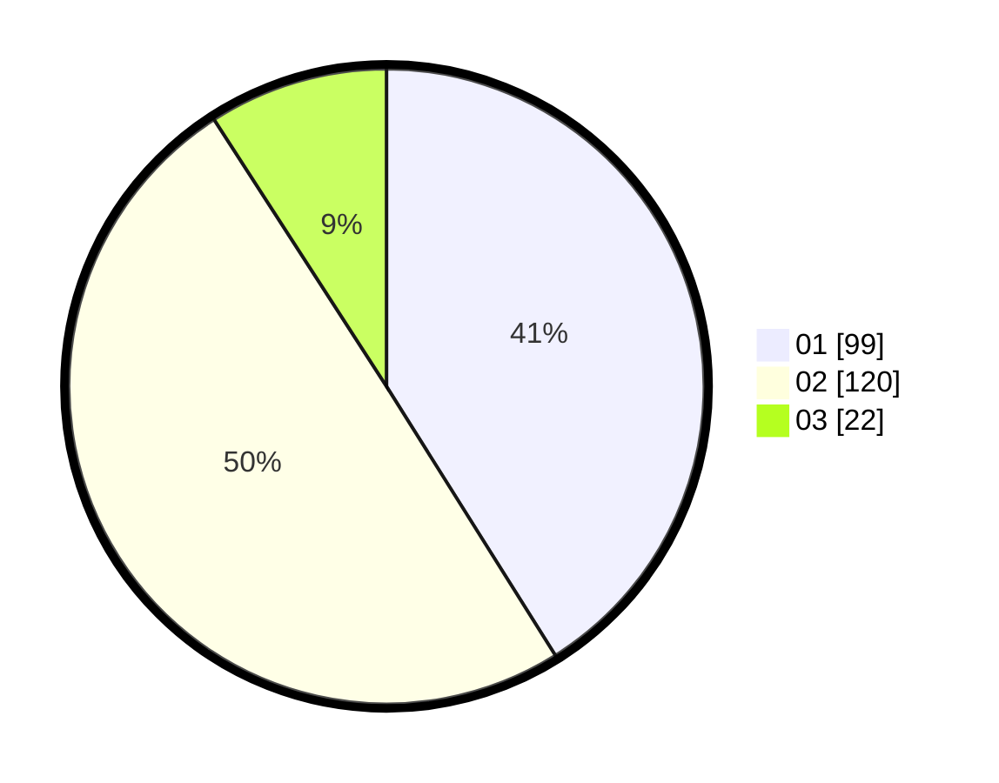

# Hasil

Hasil perolehan suara paslon dapat dilihat pada file paslon-01.txt, paslon-02.txt, dan paslon-03.txt.

Jika tidak ada, artinya data tersebut belum ada pada SIREKAP.

## Perolehan Suara

 * Paslon 01: **99**.
 * Paslon 02: **120**.
 * Paslon 03: **22**.

## Foto C Plano

https://sirekap-obj-formc.kpu.go.id/92e4/pemilu/ppwp/31/73/01/10/06/3173011006149-20240215-002913--6c88f58c-beea-485b-a74d-0d58510d2b21.jpg

https://sirekap-obj-formc.kpu.go.id/92e4/pemilu/ppwp/31/73/01/10/06/3173011006149-20240215-002932--2f950452-5ad7-472e-acc2-cf4557e618b0.jpg

https://sirekap-obj-formc.kpu.go.id/92e4/pemilu/ppwp/31/73/01/10/06/3173011006149-20240215-002951--261a970c-5bac-4e08-ba2b-1c465827e817.jpg

## DATA PEMILIH TETAP

Jumlah pemilih dalam DPT: **294**.
 * L: **134**.
 * P: **160**.

## DATA PENGGUNA HAK PILIH

Jumlah pengguna hak pilih dalam DPT: **242**.
 * L: **110**.
 * P: **132**.

Jumlah pengguna hak pilih dalam DPTb: **1**.
 * L: **1**.
 * P: **0**.

Jumlah pengguna hak pilih dalam DPK: **4**.
 * L: **2**.
 * P: **2**.

Jumlah pengguna hak pilih: **247**.
 * L: **113**.
 * P: **134**.

## JUMLAH SUARA SAH DAN TIDAK SAH

JUMLAH SELURUH SUARA SAH: **241**.

JUMLAH SUARA TIDAK SAH: **6**.

JUMLAH SELURUH SUARA SAH DAN SUARA TIDAK SAH: **247**.
