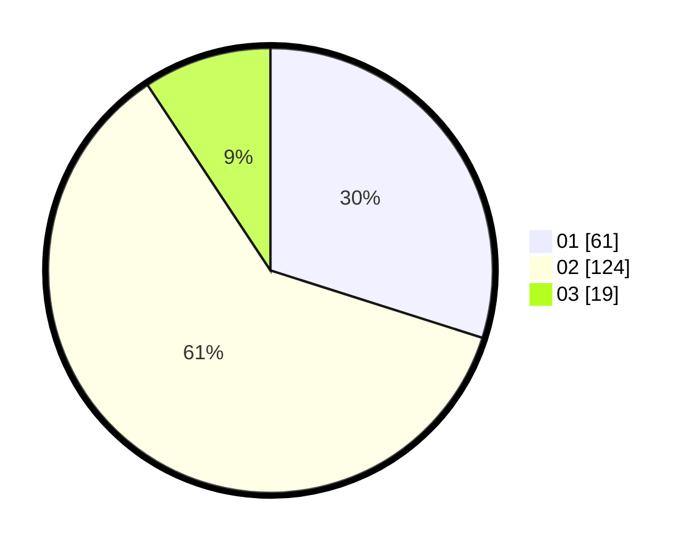

# Hasil

Hasil perolehan suara paslon dapat dilihat pada file paslon-01.txt, paslon-02.txt, dan paslon-03.txt.

Jika tidak ada, artinya data tersebut belum ada pada SIREKAP.

## Perolehan Suara

 * Paslon 01: **61**.
 * Paslon 02: **124**.
 * Paslon 03: **19**.

## Foto C Plano

https://sirekap-obj-formc.kpu.go.id/271b/pemilu/ppwp/31/73/01/10/06/3173011006155-20240216-144333--28811f9a-016c-462d-bbfb-40b255bb5586.jpg

https://sirekap-obj-formc.kpu.go.id/271b/pemilu/ppwp/31/73/01/10/06/3173011006155-20240216-144335--7d7f0ef9-ee03-452f-94be-f160a5f7bfcb.jpg

https://sirekap-obj-formc.kpu.go.id/271b/pemilu/ppwp/31/73/01/10/06/3173011006155-20240216-144334--be58eb03-b22b-4a1f-8b03-9e460134108d.jpg

## DATA PEMILIH TETAP

Jumlah pemilih dalam DPT: **275**.
 * L: **139**.
 * P: **136**.

## DATA PENGGUNA HAK PILIH

Jumlah pengguna hak pilih dalam DPT: **211**.
 * L: **105**.
 * P: **106**.

Jumlah pengguna hak pilih dalam DPTb: **0**.
 * L: **0**.
 * P: **0**.

Jumlah pengguna hak pilih dalam DPK: **0**.
 * L: **0**.
 * P: **0**.

Jumlah pengguna hak pilih: **211**.
 * L: **105**.
 * P: **106**.

## JUMLAH SUARA SAH DAN TIDAK SAH

JUMLAH SELURUH SUARA SAH: **204**.

JUMLAH SUARA TIDAK SAH: **7**.

JUMLAH SELURUH SUARA SAH DAN SUARA TIDAK SAH: **211**.
