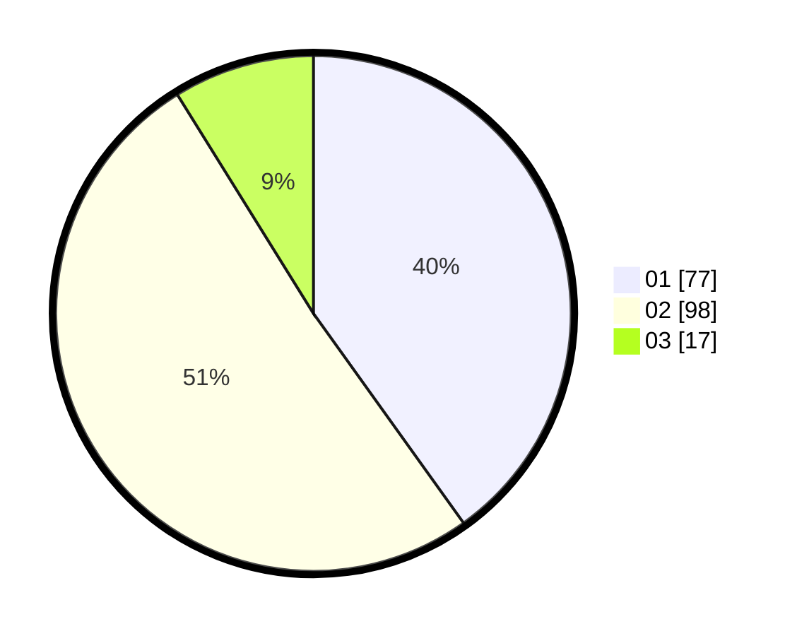

# Hasil

Hasil perolehan suara paslon dapat dilihat pada file paslon-01.txt, paslon-02.txt, dan paslon-03.txt.

Jika tidak ada, artinya data tersebut belum ada pada SIREKAP.

## Perolehan Suara

 * Paslon 01: **77**.
 * Paslon 02: **98**.
 * Paslon 03: **17**.

## Foto C Plano

https://sirekap-obj-formc.kpu.go.id/ff72/pemilu/ppwp/31/73/01/10/06/3173011006161-20240215-213021--ee38d056-fc01-43f8-a1d0-e4a08fe199cf.jpg

https://sirekap-obj-formc.kpu.go.id/ff72/pemilu/ppwp/31/73/01/10/06/3173011006161-20240215-213132--c0996c89-c23e-45b5-ba3b-190f8d4a3057.jpg

https://sirekap-obj-formc.kpu.go.id/ff72/pemilu/ppwp/31/73/01/10/06/3173011006161-20240215-213217--d080cc95-5880-41c0-839b-ce1bce77e83d.jpg
