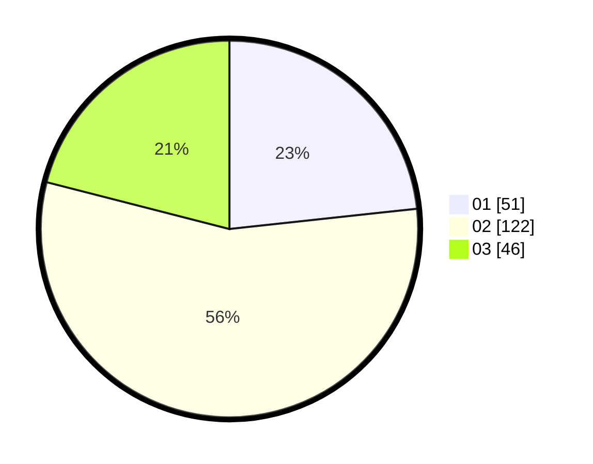

# Hasil

Hasil perolehan suara paslon dapat dilihat pada file paslon-01.txt, paslon-02.txt, dan paslon-03.txt.

Jika tidak ada, artinya data tersebut belum ada pada SIREKAP.

## Perolehan Suara

 * Paslon 01: **51**.
 * Paslon 02: **122**.
 * Paslon 03: **46**.

## Foto C Plano

https://sirekap-obj-formc.kpu.go.id/235c/pemilu/ppwp/31/73/01/10/06/3173011006164-20240215-203644--8b662b43-8546-4441-868a-0a994b53b1df.jpg

https://sirekap-obj-formc.kpu.go.id/235c/pemilu/ppwp/31/73/01/10/06/3173011006164-20240215-203655--94cdc546-f077-4d4c-9c40-f339d07cb34d.jpg

https://sirekap-obj-formc.kpu.go.id/235c/pemilu/ppwp/31/73/01/10/06/3173011006164-20240215-203649--356a6ddc-ce51-46c8-8c73-d3645ec0ca55.jpg

## DATA PEMILIH TETAP

Jumlah pemilih dalam DPT: **223**.
 * L: **110**.
 * P: **113**.

## DATA PENGGUNA HAK PILIH

Jumlah pengguna hak pilih dalam DPT: **222**.
 * L: **110**.
 * P: **112**.

Jumlah pengguna hak pilih dalam DPTb: **0**.
 * L: **0**.
 * P: **0**.

Jumlah pengguna hak pilih dalam DPK: **1**.
 * L: **0**.
 * P: **1**.

Jumlah pengguna hak pilih: **223**.
 * L: **110**.
 * P: **113**.

## JUMLAH SUARA SAH DAN TIDAK SAH

JUMLAH SELURUH SUARA SAH: **219**.

JUMLAH SUARA TIDAK SAH: **4**.

JUMLAH SELURUH SUARA SAH DAN SUARA TIDAK SAH: **223**.
