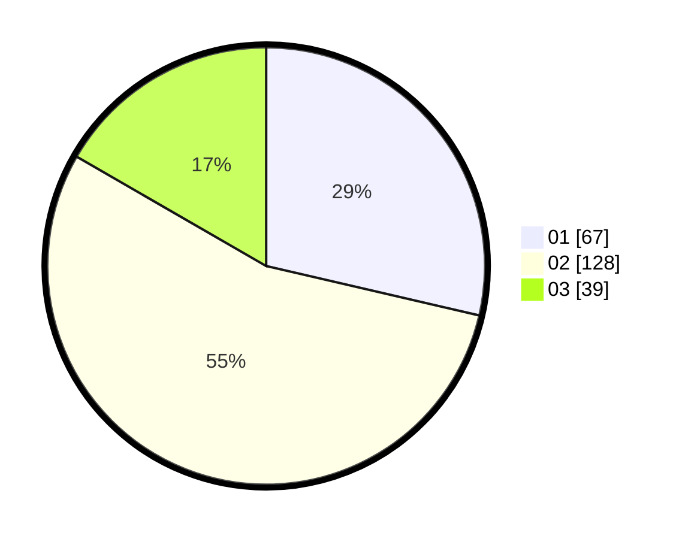

# Hasil

Hasil perolehan suara paslon dapat dilihat pada file paslon-01.txt, paslon-02.txt, dan paslon-03.txt.

Jika tidak ada, artinya data tersebut belum ada pada SIREKAP.

## Perolehan Suara

 * Paslon 01: **67**.
 * Paslon 02: **128**.
 * Paslon 03: **39**.

## Foto C Plano

https://sirekap-obj-formc.kpu.go.id/b29d/pemilu/ppwp/31/73/01/10/06/3173011006171-20240216-142111--f455ed7f-4d9a-425a-a9e2-756fc9aae936.jpg

https://sirekap-obj-formc.kpu.go.id/b29d/pemilu/ppwp/31/73/01/10/06/3173011006171-20240216-142112--d4689e38-25fb-4c94-b522-15757de626dc.jpg

https://sirekap-obj-formc.kpu.go.id/b29d/pemilu/ppwp/31/73/01/10/06/3173011006171-20240216-142112--44aa9a22-9bed-462b-9504-efa3e2ea073c.jpg

## DATA PEMILIH TETAP

Jumlah pemilih dalam DPT: **287**.
 * L: **150**.
 * P: **137**.

## DATA PENGGUNA HAK PILIH

Jumlah pengguna hak pilih dalam DPT: **238**.
 * L: **119**.
 * P: **119**.

Jumlah pengguna hak pilih dalam DPTb: **0**.
 * L: **0**.
 * P: **0**.

Jumlah pengguna hak pilih dalam DPK: **2**.
 * L: **1**.
 * P: **1**.

Jumlah pengguna hak pilih: **240**.
 * L: **120**.
 * P: **120**.

## JUMLAH SUARA SAH DAN TIDAK SAH

JUMLAH SELURUH SUARA SAH: **234**.

JUMLAH SUARA TIDAK SAH: **6**.

JUMLAH SELURUH SUARA SAH DAN SUARA TIDAK SAH: **240**.
