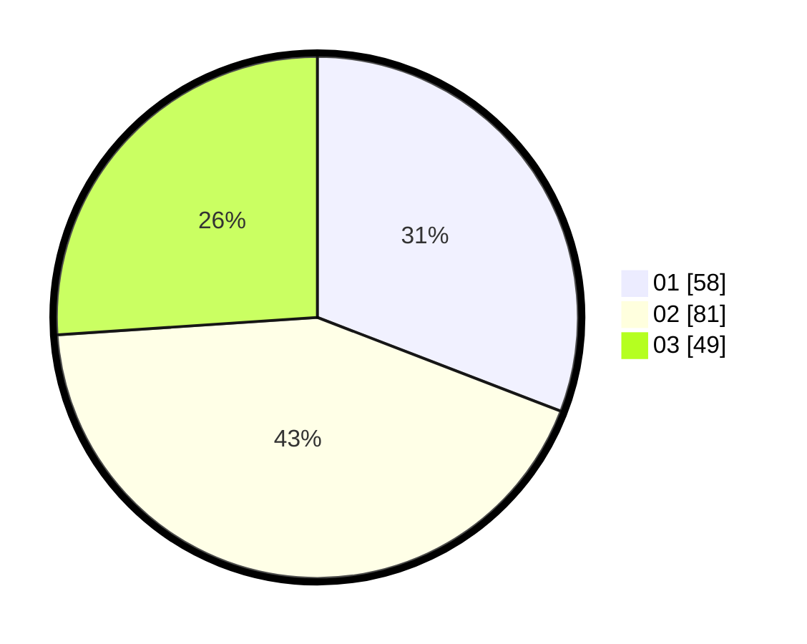

# Hasil

Hasil perolehan suara paslon dapat dilihat pada file paslon-01.txt, paslon-02.txt, dan paslon-03.txt.

Jika tidak ada, artinya data tersebut belum ada pada SIREKAP.

## Perolehan Suara

 * Paslon 01: **58**.
 * Paslon 02: **81**.
 * Paslon 03: **49**.

## Foto C Plano

https://sirekap-obj-formc.kpu.go.id/79b6/pemilu/ppwp/31/73/01/10/06/3173011006174-20240216-110950--d221477b-9ec4-4406-93ef-4a330717efd0.jpg

https://sirekap-obj-formc.kpu.go.id/79b6/pemilu/ppwp/31/73/01/10/06/3173011006174-20240216-110952--074cf221-c9cb-4a21-943f-d39523f67942.jpg

https://sirekap-obj-formc.kpu.go.id/79b6/pemilu/ppwp/31/73/01/10/06/3173011006174-20240216-110951--043feb92-024a-46e5-a11f-ed7844796e7a.jpg

## DATA PEMILIH TETAP

Jumlah pemilih dalam DPT: **282**.
 * L: **137**.
 * P: **145**.

## DATA PENGGUNA HAK PILIH

Jumlah pengguna hak pilih dalam DPT: **189**.
 * L: **88**.
 * P: **101**.

Jumlah pengguna hak pilih dalam DPTb: **3**.
 * L: **0**.
 * P: **3**.

Jumlah pengguna hak pilih dalam DPK: **0**.
 * L: **0**.
 * P: **0**.

Jumlah pengguna hak pilih: **192**.
 * L: **88**.
 * P: **104**.

## JUMLAH SUARA SAH DAN TIDAK SAH

JUMLAH SELURUH SUARA SAH: **188**.

JUMLAH SUARA TIDAK SAH: **4**.

JUMLAH SELURUH SUARA SAH DAN SUARA TIDAK SAH: **192**.
