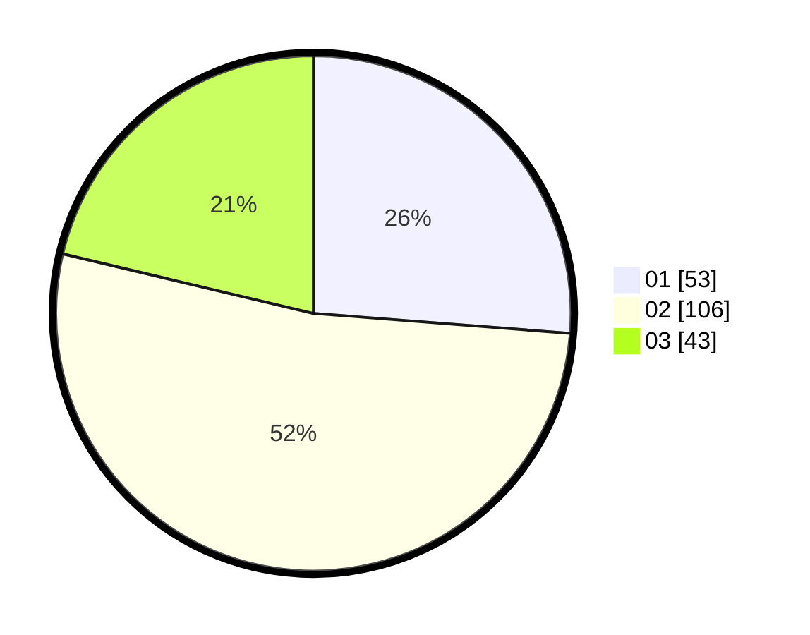

# Hasil

Hasil perolehan suara paslon dapat dilihat pada file paslon-01.txt, paslon-02.txt, dan paslon-03.txt.

Jika tidak ada, artinya data tersebut belum ada pada SIREKAP.

## Perolehan Suara

 * Paslon 01: **53**.
 * Paslon 02: **106**.
 * Paslon 03: **43**.

## Foto C Plano

https://sirekap-obj-formc.kpu.go.id/4a0f/pemilu/ppwp/31/73/01/10/06/3173011006176-20240216-134845--33474119-81d9-4d12-8edb-93644c4855d7.jpg

https://sirekap-obj-formc.kpu.go.id/4a0f/pemilu/ppwp/31/73/01/10/06/3173011006176-20240216-134846--1d79e6ef-3d2d-4034-9002-aaf12b2f5a7b.jpg

https://sirekap-obj-formc.kpu.go.id/4a0f/pemilu/ppwp/31/73/01/10/06/3173011006176-20240216-134846--21eaa14a-d6aa-4e46-a4aa-104e58a103cb.jpg

## DATA PEMILIH TETAP

Jumlah pemilih dalam DPT: **289**.
 * L: **147**.
 * P: **142**.

## DATA PENGGUNA HAK PILIH

Jumlah pengguna hak pilih dalam DPT: **202**.
 * L: **99**.
 * P: **103**.

Jumlah pengguna hak pilih dalam DPTb: **1**.
 * L: **0**.
 * P: **1**.

Jumlah pengguna hak pilih dalam DPK: **2**.
 * L: **0**.
 * P: **2**.

Jumlah pengguna hak pilih: **205**.
 * L: **99**.
 * P: **106**.

## JUMLAH SUARA SAH DAN TIDAK SAH

JUMLAH SELURUH SUARA SAH: **202**.

JUMLAH SUARA TIDAK SAH: **3**.

JUMLAH SELURUH SUARA SAH DAN SUARA TIDAK SAH: **205**.
