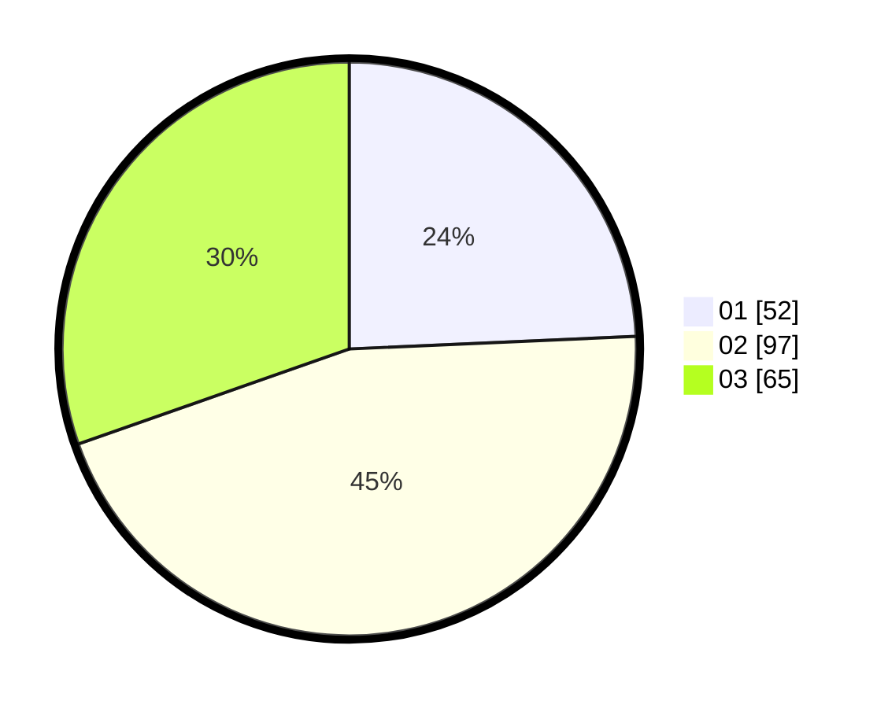

# Hasil

Hasil perolehan suara paslon dapat dilihat pada file paslon-01.txt, paslon-02.txt, dan paslon-03.txt.

Jika tidak ada, artinya data tersebut belum ada pada SIREKAP.

## Perolehan Suara

 * Paslon 01: **52**.
 * Paslon 02: **97**.
 * Paslon 03: **65**.

## Foto C Plano

https://sirekap-obj-formc.kpu.go.id/400f/pemilu/ppwp/31/73/01/10/06/3173011006177-20240215-000548--94b36aa2-2c06-4b95-bad4-0639689ef444.jpg

https://sirekap-obj-formc.kpu.go.id/400f/pemilu/ppwp/31/73/01/10/06/3173011006177-20240215-044236--166057ff-1daa-4c1d-bfad-65f99d2ac0c8.jpg

https://sirekap-obj-formc.kpu.go.id/400f/pemilu/ppwp/31/73/01/10/06/3173011006177-20240215-001214--f36de192-dc64-4e07-8701-40d028f41be3.jpg
