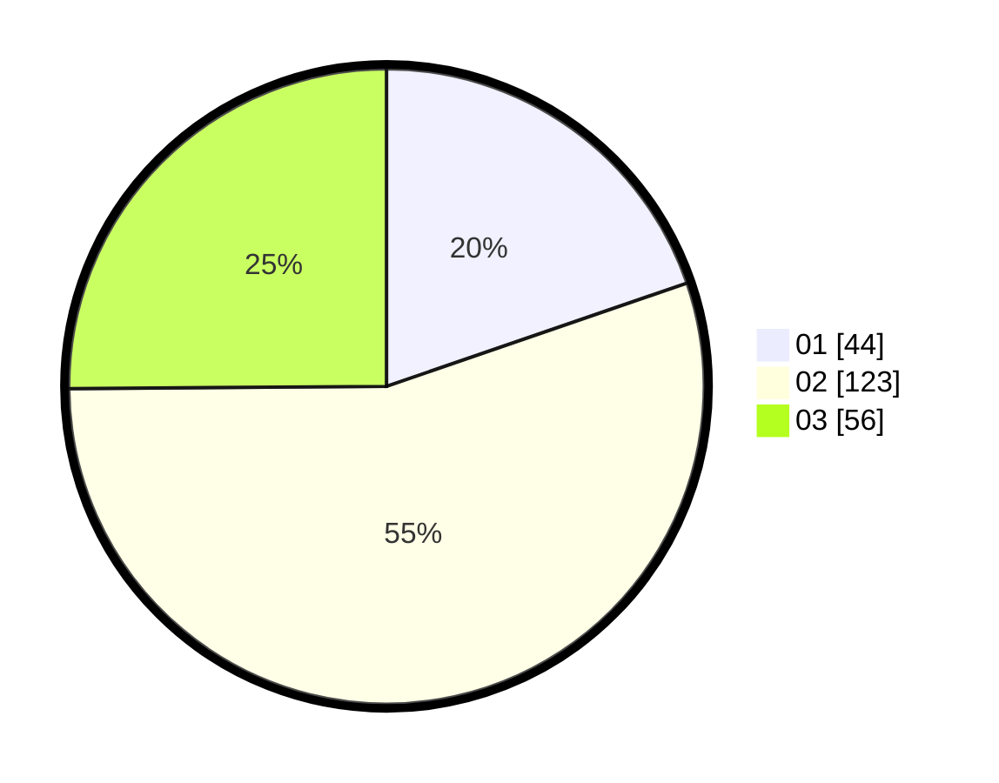

# Hasil

Hasil perolehan suara paslon dapat dilihat pada file paslon-01.txt, paslon-02.txt, dan paslon-03.txt.

Jika tidak ada, artinya data tersebut belum ada pada SIREKAP.

## Perolehan Suara

 * Paslon 01: **44**.
 * Paslon 02: **123**.
 * Paslon 03: **56**.

## Foto C Plano

https://sirekap-obj-formc.kpu.go.id/1739/pemilu/ppwp/31/73/01/10/06/3173011006178-20240215-001028--c2a198a1-e899-4d03-b9a0-a3286182cc03.jpg

https://sirekap-obj-formc.kpu.go.id/1739/pemilu/ppwp/31/73/01/10/06/3173011006178-20240215-001140--f3093e83-f0cc-4d01-896b-334b611a00da.jpg

https://sirekap-obj-formc.kpu.go.id/1739/pemilu/ppwp/31/73/01/10/06/3173011006178-20240215-001257--a807fb7a-9820-4d0c-9519-cd525d17daf3.jpg

## DATA PEMILIH TETAP

Jumlah pemilih dalam DPT: **289**.
 * L: **126**.
 * P: **163**.

## DATA PENGGUNA HAK PILIH

Jumlah pengguna hak pilih dalam DPT: **221**.
 * L: **93**.
 * P: **128**.

Jumlah pengguna hak pilih dalam DPTb: **4**.
 * L: **1**.
 * P: **3**.

Jumlah pengguna hak pilih dalam DPK: **0**.
 * L: **0**.
 * P: **0**.

Jumlah pengguna hak pilih: **225**.
 * L: **94**.
 * P: **131**.

## JUMLAH SUARA SAH DAN TIDAK SAH

JUMLAH SELURUH SUARA SAH: **223**.

JUMLAH SUARA TIDAK SAH: **2**.

JUMLAH SELURUH SUARA SAH DAN SUARA TIDAK SAH: **225**.
