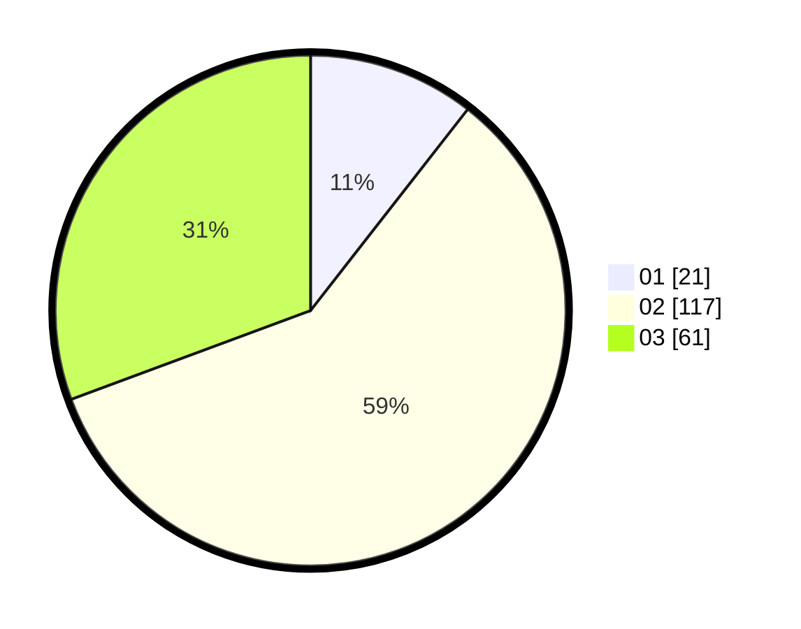

# Hasil

Hasil perolehan suara paslon dapat dilihat pada file paslon-01.txt, paslon-02.txt, dan paslon-03.txt.

Jika tidak ada, artinya data tersebut belum ada pada SIREKAP.

## Perolehan Suara

 * Paslon 01: **21**.
 * Paslon 02: **117**.
 * Paslon 03: **61**.

## Foto C Plano

https://sirekap-obj-formc.kpu.go.id/a5c4/pemilu/ppwp/31/73/01/10/06/3173011006179-20240215-002027--c503d39e-7af4-4f2e-9835-97ec1fa6e8f7.jpg

https://sirekap-obj-formc.kpu.go.id/a5c4/pemilu/ppwp/31/73/01/10/06/3173011006179-20240215-002225--caed5ded-6ff0-41e5-b950-7312d02c69d1.jpg

https://sirekap-obj-formc.kpu.go.id/a5c4/pemilu/ppwp/31/73/01/10/06/3173011006179-20240215-002406--803e5e9e-94cc-479f-a1d6-e08b1ad76f96.jpg
